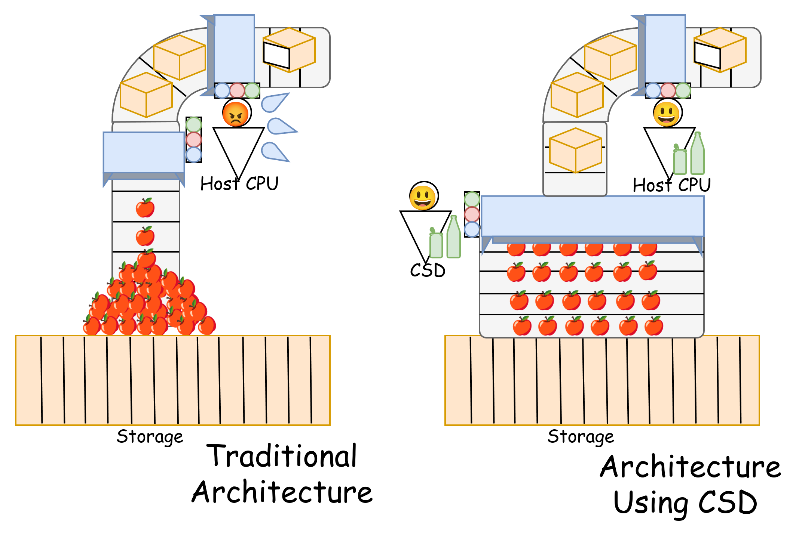
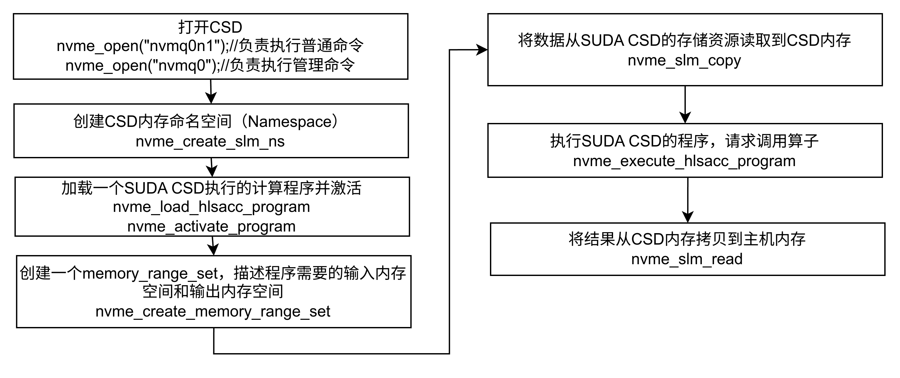

# SUDA(Computational **S**torage with **U**nified Programming Model **D**evice **A**rchetype)

[中文](README.md) | [English](README_EN.md)

## 什么是SUDA？
SUDA是基于具有通用处理器核的片上系统（SoC）以及可编程逻辑门阵列（FPGA）的，具有统一编程模型（流式编程模型+内存搬运的编程模型）的可计算存储设备架构。

## NEST LWE 加解密扩展

`nest` 分支在 SUDA 上增加了 psi64/V80 HPU-native LWE 加密、解密算子，
以及下面的完整实验通路：

```bash
git clone -b nest git@10.30.19.43:yangchenghui/suda.git "$HOME/suda"
```

```text
SSD -> SLM -> FPGA LWE encrypt -> Host memory -> TCP -> remote HPU
    -> Host memory -> decrypt input SLM -> FPGA LWE decrypt
    -> decrypt output SLM -> NVMe Copy -> SSD
```

该分支的源码准备、匹配密钥安装、算子构建、QEMU/NVMQ 初始化和可直接执行的
加解密命令见：

- [`docs/user-guides/NEST_SUDA交接说明.md`](docs/user-guides/NEST_SUDA交接说明.md)
- [`host/applications/vscode-lwe-encrypt-offload/README.md`](host/applications/vscode-lwe-encrypt-offload/README.md)
- [`host/applications/vscode-lwe-decrypt-offload/README.md`](host/applications/vscode-lwe-decrypt-offload/README.md)
- [`host/applications/vscode-lwe-full-pipeline/README.md`](host/applications/vscode-lwe-full-pipeline/README.md)

当前 FPGA 随机数和噪声实现仍是研究原型，不能用于生产密码系统。

## 可计算存储是什么？

可计算存储设备（Computational Storage Device, CSD）是一类将算力设备（如CPU或FPGA）部署在存储设备内部或者附近的新型设备。
在传统的计算机系统中，数据需要从存储盘中读取到主机处理器进行计算，存储盘与主机的带宽限制了数据处理的性能（具体体现在数据吞吐率，处理时间），而主机处理器长期被存储有关的任务占据，为其他任务执行带来了更高延迟。
当前云和数据中心需要处理的数据量呈指数级增加，需要更强的处理性能和更高的数据吞吐，可计算存储设备将和存储有关的任务卸载到与存储盘更近、带宽更高的算力资源上，这些算力资源计算完成后再将结果返回给主机处理器。由于这些算力资源和存储盘之间的带宽相比主机-存储要更高，因此在算力资源性能足够的情况下，能够提供更高的数据吞吐，主机处理器也从繁重的IO任务中解放，能够执行其他的计算任务。




## SUDA解决什么问题？

针对传统单一算力CSD的固有局限，新型SoC-FPGA混合架构实现了异构计算优势互补：包含通用处理器核的SoC负责灵活的任务调度，FPGA则专注高性能计算。然而该架构的CSD在实际使用中还面临两个层面的挑战：运行层面，FPGA在CSD上缺乏支撑抢占式调度的上下文切换机制，其使用的传统先进先出策略难以满足日益增长的实时数据处理需求；开发层面，虽然SoC在调度之外仍有计算余力，但其与 FPGA 的协同开发复杂度高，限制了SoC的计算潜力。

SUDA解决SoC-FPGA CSD在这两个层面存在的问题。
具体关键技术包括：
- 轻量级 FPGA 任务切换机制。SUDA的基于流式FPGA的上下文任务切换机制能够有效减少上下文开销时间到与软件上下文切换处于同一个数量级，为未来的各种调度算法实现提供了基础基础。
- 异构算力统一开发工具链。SUDA基于高层次综合的异构算力统一开发工具链，消除异构平台开发冗余。


## SUDA的结构

SUDA包括四个层级：主机上的应用、主机上的SUDA运行时、板卡上的控制平面软件栈、以及板卡上的SoC和FPGA的算子池。


主机上的应用程序可以使用SNIA API或者NVMe API（非NVMe标准定义，但是往驱动发送的是符合NVMe CS标准的NVMe命令）向SoC-FPGA CSD请求配置/调用算子，请求会经过libnvme/liburing传递到SUDA驱动，SUDA驱动会将请求处理为符合NVMe标准的命令传输到SoC-FPGA CSD，SoC的控制平面会处理请求，并为和计算有关的请求创建任务上下文进行调度，调度器控制轻量级FPGA任务切换机制，对已经在FPGA算子池上部署的算子进行控制，或者将SoC的算子分配到固定的计算线程进行执行。

算子使用高层次综合开发，算子代码经过统一开发工具链，可以编译为硬件算子（Verilog实现）或者是软件算子（动态链接库）。


## 项目结构


SUDA项目包含主机和SoC-FPGA CSD两个部分。

device文件夹包含了SoC-FPGA CSD需要的依赖，operators文件夹需要在主机上完成编辑，将算子编译后，拷贝到platforms/basic_shell下的资源文件夹中，生成为比特流，或者是通过API以动态链接库的方式动态拷贝到SoC-FPGA CSD。platform文件夹中，basic_shell帮助生成FPGA比特流，ips为basic_shell需要的ip核，software_stack包含SoC的软件栈代码，需要拷贝到SoC上运行。

host文件夹包含了主机需要的全部依赖，SUDA当前的实现要求用户运行qemu文件夹下的虚拟机，在虚拟机中编译并执行调用SoC-FPGA CSD的应用程序（在Applications文件夹下）。

```c++
device #SoC-FPGA需要的依赖
│   ├── operators #算子设计
│   │   ├── hls
│   │   ├── Makefile
│   │   └── scripts
│   ├── platform #底层硬件和软件
│   │   ├── basic_shell
│   │   ├── ips #底层硬件需要的特殊ip核
│   │   └── software_stack
│   └── shared_components #operators和platform都需要的依赖
│       └── hls
├── docs #文档
│   ├── api
│   ├── architecture
│   ├── images
│   │   ├── oldarchvscsdarch.png
│   │   ├── SUDAArch.png
│   │   └── sudalogo.png
│   └── user-guides
├── host #主机需要的依赖
│   ├── api
│   │   ├── libnvme
│   │   ├── liburing
│   │   └── Makefile
│   ├── applications #可用应用程序
│   │   ├── Makefile
│   │   ├── vscode-blowfish-offload
│   │   ├── vscode-grep-sw
│   │   └── vscode-slmcopy-test
│   ├── drivers #主机SUDA驱动
│   │   ├── Makefile
│   │   ├── nvmq
│   │   └── qdma
│   ├── kernel #主机内核
│   │   ├── 0001-Add-QDMA-header-files.patch
│   │   ├── 0002-Export-bio_map_user_iov.patch
│   │   └── source
│   ├── Makefile
│   ├── mk
│   │   └── common.mk
│   └── qemu #虚拟机资源
│       ├── bind_vfio.sh
│       ├── bzImage
│       ├── debian_qdma_dev.img
│       ├── init.sh
│       ├── qemu
│       └── run_qemu.sh
├── LICENSE
├── README_EN.md
└── README.md
```

## 环境准备

如下为SUDA原型经过验证的实验环境：


SUDA原型目前使用[Fidus Sidewinder-100板卡](https://fidus.com/sidewinder/)，该板卡允许接入四块SSD，但SUDA实现当前仅支持通过板卡的两个m.2插槽插入两块NVMe SSD。板卡通过PCIe插槽插入任意现代x86服务器主机。以下为经过验证的，可以使用SUDA的服务器的CPU型号：

|CPU型号|主机内核版本|系统版本|SUDA支持|
| ---- | ---- | ---- | ---- |
|Intel Xeon Gold 6248R | 5.4.211 | Ubuntu 20.04  LTS | ✅️ |
|Intel Xeon Gold 5218 | 5.4.211 | Ubuntu 20.04 LTS | ✅️ |


在部署完硬件后，需要克隆SUDA项目并分别配置本文硬件和软件。
```shell
git clone git@10.30.19.43:nf-csd/suda.git
git submodule update --init -recursive
```
### 设备环境配置
需要将vivado安装在`/opt/Xilinx_2020.2/Vivado/2020.2/`下（符号链接也可以），在服务器运行如下命令，生成比特流：
```shell
cd device/platform/basic_shell/nf-csd
source build_bd.sh
```
> 如果中途失败，检查项目是否正常配置，如果项目未经修改依旧出错，重新设置文件夹：
```shell
cd device/platform/basic_shell/nf-csd
mkdir -p work_farm/target/
cd work_farm/target 
ln -s ../../nf-csd nf-csd   
cd ../ && ln -s ../shell shell
source build_bd.sh
```

> 如果出现设备树错误，如`Device Tree Source is not correctly specified.`进行如下操作：

```shell
cd device/platform/basic_shell/nf-csd
make -C work_farm PRJ=shell:virt_one_drive FPGA_BD=fidus dt-distclean
make -C work_farm PRJ=shell:virt_one_drive FPGA_BD=fidus dt
make -C work_farm PRJ=shell:virt_one_drive FPGA_BD=$TARGET_BOARD WITH_BIT=y IO_CACHE_COHERENCE=y bootbin
```


生成的`BOOT.bin`和`zynqmp.dtb`在`nf-csd/shell/virt_one_drive/ready_for_download/fidus/`路径下，将其拷贝到板卡的引导分区。


然后，使用NFS或者拷贝的方式，将软件栈提供给板卡（板卡IP假设为10.156.153.120）：
```shell
scp -r device/platform/software_stack/ root@10.156.153.120:~/software_stack/
```

software_stack中config.json描述了FPGA当前已经部署算子的配置信息（不包括动态可重构的算子）,默认的比特流中包含了两个算子，一个是名字为add的伪算子，另一个是名为encrypt的Blowfish加解密算子。算子主要的参数为`operator_type_id`和`slot_id`，相同的`operator_type_id`负责实现相同的功能，`slot_id`是唯一的，标记部署在FPGA的不同算子。如果FPGA算子包含多个数据流接口(channel)，数据流会根据`slot_id`和`channel_id`路由。
```
{
    "operators": [
        {
            "operator_type_id":0,
            "operator_type_name": "add",
            "operator_inport_num": 1,
            "operator_outport_num": 1,
            "esti_executed_times": 80,
            "worse_executed_times": 240,
            "bram_size": 2048,
            "slot_id" : 0
        },
        {
            "operator_type_id":1,
            "operator_type_name": "encrypt",
            "operator_inport_num": 1,
            "operator_outport_num": 1,
            "esti_executed_times": 20,
            "worse_executed_times": 80,
            "bram_size": 2048,
            "slot_id" : 1
        }
    ]
}
```


如果software_stack的路径不是`/root/software_stack/`，则需要修改代码中读取config.json的位置，打开`/root/software_stack/nf_spdk/lib/hlsacccompute/hlsacccompute.c`:

```c
void spdk_hlsacccompute_init_opconfig(struct spdk_hlsacccompute_dev *dev)
{
    FILE *f;
    char *buffer = NULL;
    long file_size;
    struct spdk_json_val *values = NULL;
    size_t values_cnt = 0;
    struct spdk_json_val *operators_val;
    int rc = -1;

    // 读取配置文件
    // 修改这一行的路径
    f = fopen("/root/software_stack/nf_spdk/config.json", "r");
    if (!f)
    {
        SPDK_ERRLOG("Failed to open config file\n");
        return -1;
    }
...
}
```

然后，编译软件栈：

```shell
./configure 
make
```
在编译成功后，代表设备侧已经配置完成。

### 主机环境准备

当前的SUDA驱动**仅在内核5.4.211**验证，且需要使用补丁修改后的内核。因此建议在qemu虚拟机里操作。首先需要配置qemu虚拟机

```shell
cd host/qemu/qemu/
mkdir build && cd build
./configure --enable-kvm --enable-virtfs --target-list=x86_64-softmmu
make
```

然后，需要配置内核和虚拟磁盘。以下命令会首先编译内核并将内核`bzImage`拷贝到`host/qemu/`目录下，随后创建虚拟磁盘`debian_qdma_dev.img`，创建文件系统并且安装全部所需依赖。
```shell
cd host/qemu/
sudo bash init.sh
```

然后，虚拟机即可开启，但是在虚拟机开启之前，还需要检查主机的vfio已经开启，查看`/etc/default/grub`，查看iommu选项是否设置为`on`：
```
GRUB_CMDLINE_LINUX_DEFAULT="quiet splash iommu=pt intel_iommu=on pcie_acs_override=downstream,multifunction vfio-pci.ids=10ee:903f"
```
如果没有按照上述内容进行修改，则需要按照上述内容进行对应修改，然后更新grub并且重启服务器：
```shell
sudo update-grub
sudo reboot
```
在以上步骤全部结束后，编辑`/host/qemu/run_qemu.sh`，SoC-FPGA CSD通过vfio直通给虚拟机，因此需要在qemu的启动参数上指定CSD的PCIe地址（假设当前为3b:00.0）：
```shell
./qemu/build/qemu-system-x86_64 \
    -name "qdma-test-0",debug-threads=on \
    -machine accel=kvm \
    -cpu host \
    -smp 4 \
    -m 16G \
    -device virtio-scsi-pci,id=scsi0 \
    -kernel $KERNELIMGF \
    -drive file=$OSIMGF,format=raw \
    -append "root=/dev/sda rw console=ttyS0 nokaslr net.ifnames=0 biosdevname=0 cgroup_no_v1=all" \
    -netdev user,id=net0,hostfwd=tcp::$SSHPORT-:22 \
    -device virtio-net-pci,netdev=net0 \
    -device pcie-root-port,id=pcie.1,addr=08.0,slot=1 \
    -device vfio-pci,host=3b:00.0,bus=pcie.1 \ ------>修改PCIe地址
    -fsdev local,id=fs1,path="../../.",security_model=none \
    -device virtio-9p-pci,fsdev=fs1,mount_tag=suda \
    -monitor unix:./qmp-sock,server,nowait \
    -serial stdio 
```

接下来，修改`/host/qemu/bind_vfio.sh`，并且修改需要绑定vfio的PCIe地址，然后运行脚本`sudo source bind_vfio.sh`。绑定vfio之后，启动qemu虚拟机`sudo bash run_nvmq.sh -f`，启动之后，可以使用ssh通过`run_nvmq.sh`中的`SSHPORT`端口访问虚拟机，虚拟机将SUDA目录挂载到了`/mnt/suda/`，进入`/mnt/suda/host`编译虚拟机需要的内核模块、SUDA应用和依赖库：

```shell
cd /mnt/suda/host
sudo make
sudo poweroff
```

至此，已经环境准备工作已经全部完成。


## SUDA使用

在配置完成环境后，即可以使用SUDA了。首先从SoC-FPGA CSD上启动软件栈，也就是登录到板卡的ARM核上，在ARM核上操作：
```shell
cd software_stack/nf_spdk
bash setup.sh
cd mcdma 
bash run_nvmq.sh 
```
在等待SoC-FPGA CSD软件栈初始化完成后（一般等待5s），然后不要退出ARM核上运行的进程，回到主机，在主机端启动虚拟机：
```shell
sudo bash run_nvmq.sh -f
ssh -p8999 developer@localhost
#在虚拟机中
cd /mnt/suda/host/drivers/nvmq
sudo su
bash init_nvmq.sh
cat nvmq0_opts > /dev/nvmq-fabrics # fabric connect & identify
fio tests/single_write.fio # 或者其他测试程序，例如计算
```

测试通过代表SoC-FPGA CSD已经可以被虚拟机访问，接下来，可以尝试运行一个简单的SUDA示例应用。
```shell
vscode-blowfish-offload 使用SUDA调用一个FPGA侧Blowfish加密算子，加密CSD中的数据
vscode-grep-sw 使用SUDA调用一个SoC侧的Grep算子，从盘中抓去部分数据
vscode-slmcopy-test 从SUDA CSD内存与主机内存中执行多次内存拷贝
```
以`vscode-blowfish-offload`为例，它使用基于`libnvme`和`liburing`的SUDA API，通过符合NVMe CS标准的NVMe命令直接传递给CSD的方式控制CSD计算。
下图为vscode-blowfish-offload.cpp执行同步blowfish计算时候需要调用的API顺序：

```shell
#在虚拟机运行vscode-blowfish-offload
cd /mnt/suda/host/applications/vscode-blowfish-offload
./vscode-blowfish-offload

```

接下来，以`vscode-grep-sw`为例，这个程序尝试加载软算子`suda/device/operators/hls/grep/libgrep.so`到SUDA CSD上并运行1MB负载，因此一定要先参照device的配置把算子编译出来才能继续接下来的步骤，首先生成测试数据集：

```shell
cd host/util/grep_data_gen
bash compile.sh
./data_gen
```
然后在主机侧，生成在SUDA CSD运行的软件算子：
```shell
cd device/operators
make swop_gen #使用make all也可以
```
然后启动qemu虚拟机，运行测试程序：
```shell
cd /mnt/suda/host/applications/vscode-grep-sw
./vscode-grep-sw
```

## 用户指引

[新增算子/计算程序/主机应用](docs/user-guides/新增算子和程序.md)
[SUDA调试手段](docs/user-guides/调试技巧.md)

## 架构解析

[架构解析](docs/architecture/SUDA架构.md)

## 应用编程接口

[API](docs/api/API参考手册.md)

## 内部用户提示
如果是SUDA的内部开发者，需要使用到SUDA底层基础设施VSCODOR的相关技术，请参考文档：
http://10.16.0.127/apps/files/files/3456?dir=/%E5%B7%A5%E7%A8%8B%E7%BB%84/%E5%AD%98%E5%82%A8%E5%8A%A0%E9%80%9F%E4%B8%8E%E8%99%9A%E6%8B%9F%E5%8C%96%E7%A0%94%E7%A9%B6/
