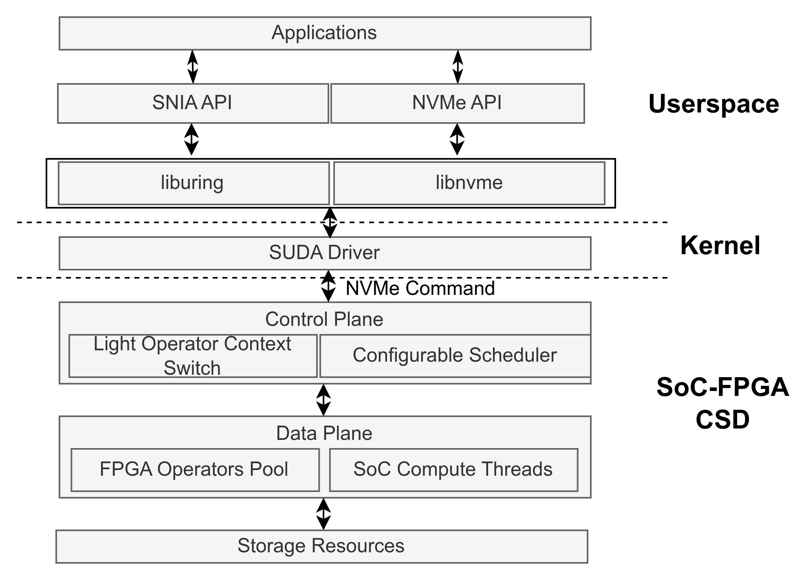
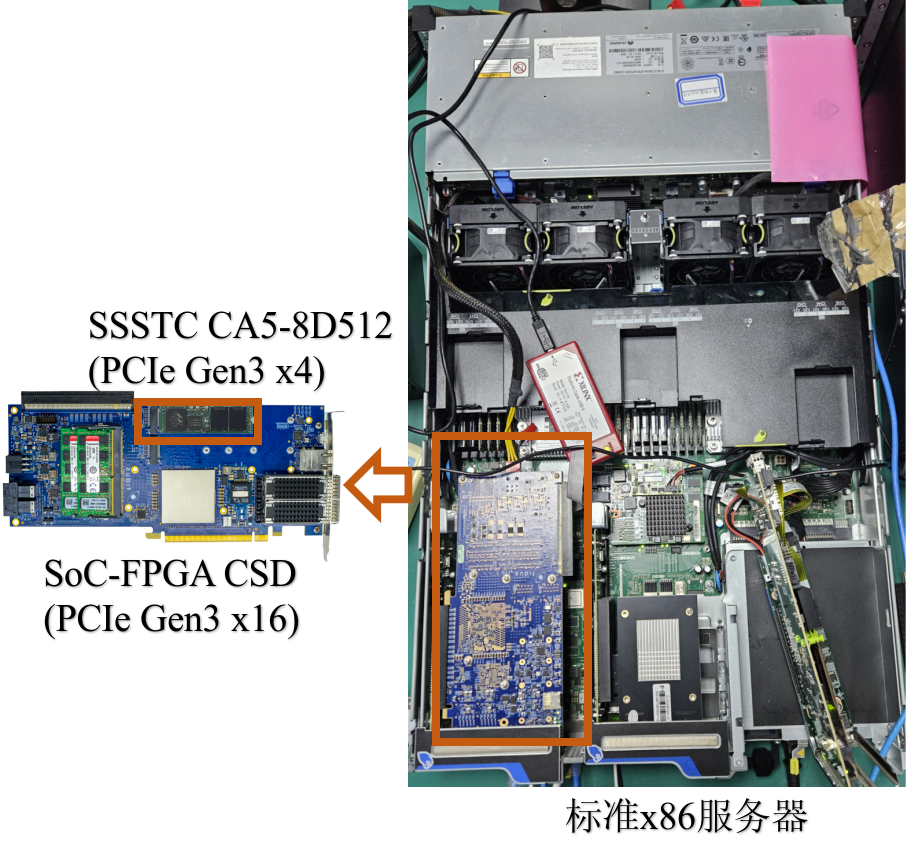
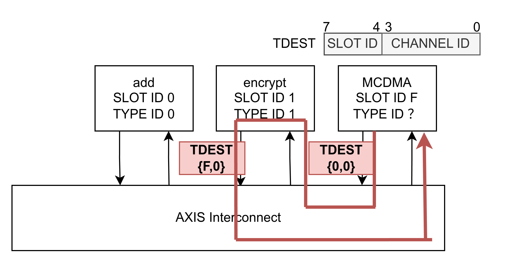
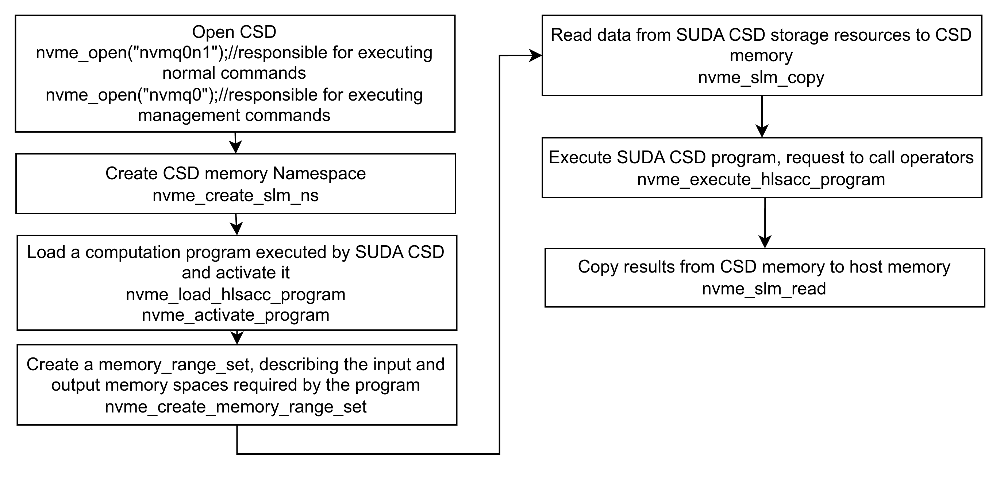

# SUDA (Computational **S**torage with **U**nified Programming Model **D**evice **A**rchetype)

[中文](README.md) | [English](README_EN.md)

## What is SUDA?
SUDA is a computational storage device architecture with a unified programming model (stream programming model + memory transfer programming model) based on System-on-Chip (SoC) with general-purpose processor cores and Field-Programmable Gate Arrays (FPGA).

## What is Computational Storage?

Computational Storage Devices (CSDs) are a new type of device that deploys computing resources (such as CPUs or FPGAs) within or near storage devices.
In traditional computer systems, data needs to be read from storage disks to the host processor for computation. The bandwidth limitation between storage disks and the host restricts data processing performance (specifically in terms of data throughput and processing time), while the host processor remains occupied with storage-related tasks, resulting in higher latency for other task execution.
With the exponential increase in data volume that current cloud and data centers need to process, there is a demand for stronger processing performance and higher data throughput. Computational storage devices offload storage-related tasks to computing resources that are closer to storage disks with higher bandwidth. After these computing resources complete the calculation, they return the results to the host processor. Since the bandwidth between these computing resources and storage disks is higher compared to the host-storage connection, given sufficient performance of the computing resources, they can provide higher data throughput. The host processor is also freed from heavy I/O tasks, enabling it to perform other computational tasks.

[csdshow](docs/images/oldarchvscsdarch.png)

## What Problems Does SUDA Solve?

To address the inherent limitations of traditional single-compute CSDs, the new SoC-FPGA hybrid architecture achieves complementary advantages of heterogeneous computing: SoCs with general-purpose processor cores handle flexible task scheduling, while FPGAs focus on high-performance computing. However, this CSD architecture still faces challenges on two levels in practical use: at the operational level, FPGAs in CSDs lack a context-switching mechanism to support preemptive scheduling, and their traditional first-in-first-out strategy struggles to meet growing real-time data processing demands; at the development level, although SoCs have computing capacity beyond scheduling, the complexity of collaborative development with FPGAs limits the computational potential of SoCs.

SUDA addresses these problems in SoC-FPGA CSDs at both levels.
Key technologies include:
- Lightweight FPGA task switching mechanism. SUDA's stream-based FPGA context task switching mechanism effectively reduces context overhead time to the same order of magnitude as software context switching, providing a foundation for future implementation of various scheduling algorithms.
- Unified development toolchain for heterogeneous computing resources. SUDA's high-level synthesis-based unified development toolchain for heterogeneous computing resources eliminates redundancy in heterogeneous platform development.

## SUDA Architecture

SUDA includes four levels: applications on the host, SUDA runtime on the host, control plane software stack on the board, and operator pools on the board's SoC and FPGA.

Host applications can use SNIA API or NVMe API (not defined by NVMe standard, but sending NVMe commands that comply with the NVMe CS standard to the driver) to request configuration/invocation of operators from the SoC-FPGA CSD. Requests are passed through libnvme/liburing to the SUDA driver, which processes them into commands conforming to the NVMe standard and transmits them to the SoC-FPGA CSD. The SoC's control plane processes the requests and creates task contexts for computation-related requests for scheduling. The scheduler controls the lightweight FPGA task switching mechanism to manage operators already deployed in the FPGA operator pool, or assigns SoC operators to fixed computing threads for execution.

Operators are developed using high-level synthesis. Operator code, through the unified development toolchain, can be compiled into hardware operators (Verilog implementation) or software operators (dynamic link libraries).



## Project Structure

The SUDA project consists of two parts: the host and the SoC-FPGA CSD.

The device folder contains the dependencies needed by the SoC-FPGA CSD. The operators folder needs to be edited on the host, and after compiling the operators, they are copied to the resource folder under platforms/basic_shell to generate bitstreams, or dynamically copied to the SoC-FPGA CSD as dynamic link libraries through the API. In the platform folder, basic_shell helps generate FPGA bitstreams, ips contains the IP cores needed by basic_shell, and software_stack contains the SoC software stack code that needs to be copied to the SoC to run.

The host folder contains all the dependencies needed by the host. The current implementation of SUDA requires users to run the virtual machine in the qemu folder and compile and execute applications that call the SoC-FPGA CSD (in the Applications folder) within the virtual machine.

```c++
device #Dependencies needed by SoC-FPGA
│   ├── operators #Operator design
│   │   ├── hls
│   │   ├── Makefile
│   │   └── scripts
│   ├── platform #Underlying hardware and software
│   │   ├── basic_shell
│   │   ├── ips #Special IP cores needed by underlying hardware
│   │   └── software_stack
│   └── shared_components #Dependencies needed by both operators and platform
│       └── hls
├── docs #Documentation
│   ├── api
│   ├── architecture
│   ├── images
│   │   ├── oldarchvscsdarch.png
│   │   ├── SUDAArch.png
│   │   └── sudalogo.png
│   └── user-guides
├── host #Dependencies needed by the host
│   ├── api
│   │   ├── libnvme
│   │   ├── liburing
│   │   └── Makefile
│   ├── applications #Available applications
│   │   ├── Makefile
│   │   ├── vscode-blowfish-offload
│   │   ├── vscode-grep-sw
│   │   └── vscode-slmcopy-test
│   ├── drivers #Host SUDA drivers
│   │   ├── Makefile
│   │   ├── nvmq
│   │   └── qdma
│   ├── kernel #Host kernel
│   │   ├── 0001-Add-QDMA-header-files.patch
│   │   ├── 0002-Export-bio_map_user_iov.patch
│   │   └── source
│   ├── Makefile
│   ├── mk
│   │   └── common.mk
│   └── qemu #Virtual machine resources
│       ├── bind_vfio.sh
│       ├── bzImage
│       ├── debian_qdma_dev.img
│       ├── init.sh
│       ├── qemu
│       └── run_qemu.sh
├── LICENSE
├── README_EN.md
└── README.md
```

## Environment Preparation

The following is the verified experimental environment for the SUDA prototype:


The SUDA prototype currently uses the [Fidus Sidewinder-100 card](https://fidus.com/sidewinder/), which allows connection to four SSDs, but the current SUDA implementation only supports inserting two NVMe SSDs through the card's two m.2 slots. The card is inserted into any modern x86 server host via a PCIe slot. The following are the CPU models of servers that have been verified to work with SUDA:

|CPU Model|Host Kernel Version|System Version|SUDA Support|
| ---- | ---- | ---- | ---- |
|Intel Xeon Gold 6248R | 5.4.211 | Ubuntu 20.04 LTS | ✅️ |
|Intel Xeon Gold 5218 | 5.4.211 | Ubuntu 20.04 LTS | ✅️ |

After deploying the hardware, you need to clone the SUDA project and configure both the hardware and software as described in this document.
```shell
git clone git@10.30.19.43:nf-csd/suda.git
git submodule update --init -recursive
```

### Device Environment Configuration
Vivado needs to be installed at `/opt/Xilinx_2020.2/Vivado/2020.2/` (symbolic links are also acceptable). Run the following command on the server to generate the bitstream:
```shell
cd device/basic_shell/nf-csd
source build_bd.sh
```
If it fails midway, check if the project is properly configured. If the project fails without modification, reset the folder:
```shell
cd device/basic_shell/nf-csd
mkdir -p work_farm/target/
cd work_farm/target 
ln -s ../../nf-csd nf-csd   
cd ../ && ln -s ../shell shell
source build_bd.sh
```
The generated `BOOT.bin` and `zynqmp.dtb` are in the `nf-csd/shell/virt_one_drive/ready_for_download/fidus/` path, copy them to the boot partition of the card.

Then, use NFS or copy to provide the software stack to the card:
```shell
scp -r device/platform/software_stack/ root@10.156.153.120:~/software_stack/
```

The config.json in software_stack describes the configuration information of operators currently deployed on the FPGA (excluding dynamically reconfigurable operators). The default bitstream includes two operators: a pseudo-operator named add and a Blowfish encryption/decryption operator named encrypt. The main parameters of operators are `operator_type_id` and `slot_id`. The same `operator_type_id` is responsible for implementing the same functionality, while `slot_id` is unique, marking different operators deployed on the FPGA. If an FPGA operator contains multiple data stream interfaces (channels), the data stream is routed according to `slot_id` and `channel_id`.
```
{
    "operators": [
        {
            "operator_type_id":0,
            "operator_type_name": "add",
            "operator_inport_num": 1,
            "operator_outport_num": 1,
            "esti_executed_times": 80,
            "worse_executed_times": 240,
            "bram_size": 2048,
            "slot_id" : 0
        },
        {
            "operator_type_id":1,
            "operator_type_name": "encrypt",
            "operator_inport_num": 1,
            "operator_outport_num": 1,
            "esti_executed_times": 20,
            "worse_executed_times": 80,
            "bram_size": 2048,
            "slot_id" : 1
        }
    ]
}
```


If the path of software_stack is not `/root/software_stack/`, you need to modify the location of reading config.json in the code. Open `/root/software_stack/nf_spdk/lib/hlsacccompute/hlsacccompute.c`:

```c
void spdk_hlsacccompute_init_opconfig(struct spdk_hlsacccompute_dev *dev)
{
    FILE *f;
    char *buffer = NULL;
    long file_size;
    struct spdk_json_val *values = NULL;
    size_t values_cnt = 0;
    struct spdk_json_val *operators_val;
    int rc = -1;

    // Read configuration file
    // Modify the path in this line
    f = fopen("/root/software_stack/nf_spdk/config.json", "r");
    if (!f)
    {
        SPDK_ERRLOG("Failed to open config file\n");
        return -1;
    }
...
}
```

Then, compile the software stack:

```shell
./configure 
make
```
After successful compilation, the device side configuration is complete.

### Host Environment Preparation

The current SUDA driver is **only verified on kernel 5.4.211** and requires a patched kernel. Therefore, it is recommended to operate in a qemu virtual machine. First, you need to configure the qemu virtual machine:

```shell
cd host/qemu/qemu/
mkdir build && cd build
../configure --enable-kvm --enable-virtfs --target-list=x86_64-softmmu
make
```

Then, you need to configure the kernel and virtual disk. The following commands will first compile the kernel and copy the kernel `bzImage` to the `host/qemu/` directory, then create a virtual disk `debian_qdma_dev.img`, create a file system, and install all required dependencies.
```shell
cd host/qemu/
sudo bash init.sh
```

After all the above steps are completed, edit `/host/qemu/run_qemu.sh`. The SoC-FPGA CSD is passed through to the virtual machine via vfio, so you need to specify the PCIe address of the CSD in the qemu startup parameters:
```shell
./qemu/build/qemu-system-x86_64 \
    -name "qdma-test-0",debug-threads=on \
    -machine accel=kvm \
    -cpu host \
    -smp 4 \
    -m 16G \
    -device virtio-scsi-pci,id=scsi0 \
    -kernel $KERNELIMGF \
    -drive file=$OSIMGF,format=raw \
    -append "root=/dev/sda rw console=ttyS0 nokaslr net.ifnames=0 biosdevname=0 cgroup_no_v1=all" \
    -netdev user,id=net0,hostfwd=tcp::$SSHPORT-:22 \
    -device virtio-net-pci,netdev=net0 \
    -device pcie-root-port,id=pcie.1,addr=08.0,slot=1 \
    -device vfio-pci,host=3b:00.0,bus=pcie.1 \ ------>Modify PCIe address
    -fsdev local,id=fs1,path="../../.",security_model=none \
    -device virtio-9p-pci,fsdev=fs1,mount_tag=suda \
    -monitor unix:./qmp-sock,server,nowait \
    -serial stdio 
```

Next, modify `/host/qemu/bind_vfio.sh` and update the PCIe address that needs to be bound to vfio, then run the script `sudo source bind_vfio.sh`. After binding vfio, start the qemu virtual machine `sudo bash run_nvmq.sh -f`. After startup, you can use ssh to access the virtual machine through the `SSHPORT` port in `run_nvmq.sh`. The virtual machine has mounted the SUDA directory to `/mnt/suda/`. Enter `/mnt/suda/host` to compile the kernel modules, SUDA applications, and dependency libraries needed by the virtual machine:

```shell
cd /mnt/suda/host
sudo make
sudo poweroff
```

At this point, all environment preparation work has been completed.

## Using SUDA

After configuring the environment, you can start using SUDA. First, start the software stack from the SoC-FPGA CSD:
```shell
cd software_stack/nf_spdk
bash setup.sh
cd mcdma 
bash run_nvmq.sh 
```
After waiting for the SoC-FPGA CSD software stack to complete initialization (usually wait 5s), then start the virtual machine on the host side:
```shell
sudo bash run_nvmq.sh -f
ssh -p8999 developer@localhost
#In the virtual machine
cd /mnt/suda/host/drivers/nvmq
sudo su
bash init_nvmq.sh
cat nvmq0_opts > /dev/nvmq-fabrics # fabric connect & identify
fio tests/single_write.fio # Or other test programs, such as computation
```

A successful test indicates that the SoC-FPGA CSD can be accessed by the virtual machine. Next, you can try running a simple SUDA example application.
```shell
vscode-blowfish-offload Uses SUDA to call an FPGA-side Blowfish encryption operator to encrypt data in the CSD
vscode-grep-sw Uses SUDA to call a SoC-side Grep operator to retrieve partial data from the disk
vscode-slmcopy-test Performs multiple memory copies between SUDA CSD memory and host memory
```
Taking `vscode-blowfish-offload` as an example, it uses SUDA API based on `libnvme` and `liburing` to control CSD computation by directly passing NVMe commands that comply with the NVMe CS standard to the CSD.
The following figure shows the API sequence that vscode-blowfish-offload.cpp needs to call when performing synchronous blowfish computation:

```shell
#Run vscode-blowfish-offload in the virtual machine
cd /mnt/suda/host/applications/vscode-blowfish-offload
./vscode-blowfish-offload
```