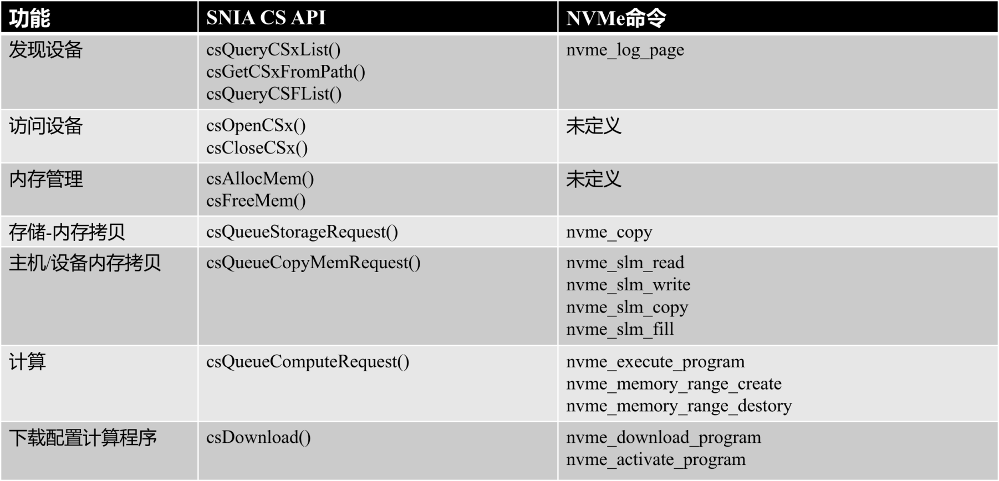

# SUDA 可计算存储 API 速查手册
SUDA底层是符合NVMe CS标准的API，基于这些API封装了SNIA CS API，SNIA CS API请查看SNIA CS API文档，本文档仅介绍底层API。

## 内存范围集管理函数

### nvme_operate_memory_range_set
**功能**: 对内存范围集执行操作（创建/删除等）
**参数**:
- `fd`: 设备文件描述符
- `nsid`: 计算命名空间ID
- `op`: 操作类型
- `numr`: 内存范围数量
- `rsid`: 结果ID（输入/输出参数）
- `mmrange_descri`: 内存范围描述符

### nvme_create_memory_range_set
**功能**: 创建一个内存范围集
**参数**:
- `fd`: 设备文件描述符
- `nsid`: 计算命名空间ID
- `rsid`: 范围集ID（输出参数）
- `numr`: 内存范围数量
- `mmrange_descri`: 内存范围描述符

### nvme_delete_memory_range_set
**功能**: 删除一个内存范围集
**参数**:
- `fd`: 设备文件描述符
- `nsid`: 计算命名空间ID
- `rsid`: 要删除的范围集ID

## 程序管理函数

### nvme_operate_program
**功能**: 对程序执行操作（加载/卸载等）
**参数**:
- `fd`: 设备文件描述符
- `nsid`: 计算命名空间ID
- `pind`: 程序索引
- `ptype`: 程序类型
- `psize`: 程序大小
- `numb`: 要传输的字节数
- `load_offset`: 加载偏移量
- `pit`: 程序ID类型
- `sel`: 选择器
- `program_data`: 程序数据
- `pid`: 程序ID

### nvme_load_hlsacc_program
**功能**: 加载HLS加速器程序
**参数**:
- `fd`: 设备文件描述符
- `psize`: 程序大小
- `pind`: 程序索引
- `nsid`: 计算命名空间ID
- `program_data`: 程序数据

### nvme_unload_hlsacc_program
**功能**: 卸载HLS加速器程序
**参数**:
- `fd`: 设备文件描述符
- `pind`: 程序索引
- `nsid`: 计算命名空间ID

### nvme_program_mgmt
**功能**: 程序管理（激活/停用等）
**参数**:
- `fd`: 设备文件描述符
- `pind`: 程序索引
- `sel`: 选择器（操作类型）
- `nsid`: 计算命名空间ID

### nvme_activate_program
**功能**: 激活一个程序
**参数**:
- `fd`: 设备文件描述符
- `pind`: 程序索引
- `nsid`: 计算命名空间ID

### nvme_deactivate_program
**功能**: 停用一个程序
**参数**:
- `fd`: 设备文件描述符
- `pind`: 程序索引
- `nsid`: 计算命名空间ID

## 程序执行函数

### nvme_execute_program
**功能**: 执行已加载的程序
**参数**:
- `fd`: 设备文件描述符
- `nsid`: 计算命名空间ID
- `rsid`: 内存范围集ID
- `pind`: 程序索引
- `numr`: 内存范围数量
- `dlen`: 数据长度
- `data_buffer`: 数据缓冲区
- `capram1`: 捕获参数1
- `capram2`: 捕获参数2
- `capram3`: 捕获参数3
- `result`: 执行结果

### nvme_execute_hlsacc_program
**功能**: 执行HLS加速器程序
**参数**:
- `fd`: 设备文件描述符
- `nsid`: 计算命名空间ID
- `rsid`: 内存范围集ID
- `pind`: 程序索引
- `contexts`: 加速器上下文数组
- `context_num`: 上下文数量
- `numr`: 内存范围数量
- `priority`: 优先级
- `result`: 执行结果

### nvme_execute_hlsacc_programV2
**功能**: 执行HLS加速器程序（增强版）
**参数**:
- `fd`: 设备文件描述符
- `nsid`: 计算命名空间ID
- `rsid`: 内存范围集ID
- `pind`: 程序索引
- `contexts`: 加速器上下文数组
- `context_num`: 上下文数量
- `numr`: 内存范围数量
- `priority`: 优先级
- `result`: 执行结果
- `run_way`: 运行方式

## 存储层内存操作函数

### nvme_slm_read
**功能**: 从指定命名空间读取数据
**参数**:
- `fd`: 设备文件描述符
- `nsid`: 命名空间ID
- `starting_bytes`: 读取的起始字节位置
- `read_length`: 读取长度（字节）
- `data`: 数据存放位置

### nvme_slm_write
**功能**: 向指定命名空间写入数据
**参数**:
- `fd`: 设备文件描述符
- `nsid`: 命名空间ID
- `starting_bytes`: 写入的起始字节位置
- `write_length`: 写入长度（字节）
- `data`: 数据来源

### nvme_slm_copy
**功能**: 在命名空间间复制数据
**参数**:
- `fd`: 设备文件描述符
- `source_range_entries`: 源范围条目数组
- `length`: 长度
- `sdaddr`: 目标地址起始位置
- `format_sel`: 描述符格式类型（02h: 基于LBA, 04h: 基于字节）
- `nr`: 源范围数量
- `nsid`: 目标命名空间ID

### nvme_slm_fill
**功能**: 用零填充指定命名空间的内存范围
**参数**:
- `fd`: 设备文件描述符
- `nsid`: 命名空间ID
- `starting_bytes`: 填充起始字节位置
- `fill_length`: 填充长度（字节）

## SUDA 底层API和SNIA CS API关系对应

