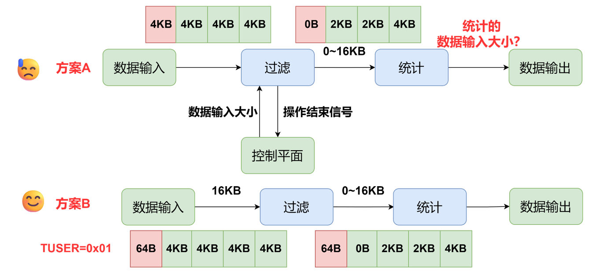
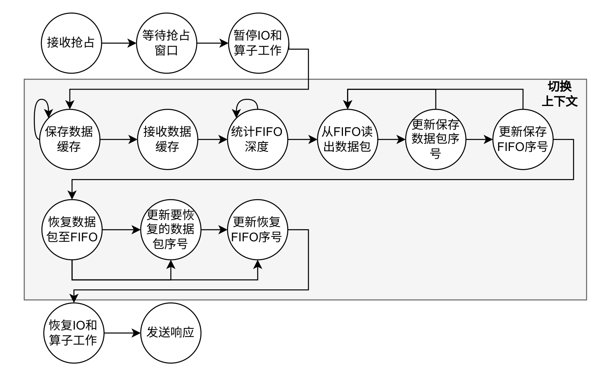
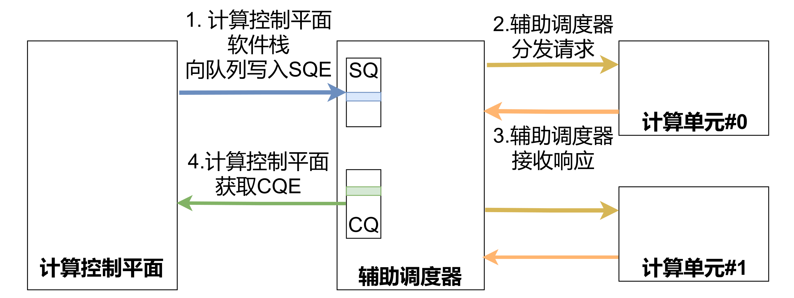

# SUDA架构

## 回顾SUDA架构图
SUDA架构中，用户通过调用SUDA API控制SUDA CSD，实际SUDA API会进一步调用libnvme和liburing的函数，将nvme命令传递至内核态。内核态的SUDA驱动实际包含两个部分：nvmq和qdma。nvmq会对nvme命令进行处理，比如对用户要求处理的虚拟地址转换为实际的物理地址，然后调用qdma将nvme命令传递至SUDA CSD。nvme command会经过qdma->mcdma，以数据流的方式保存到设备内存，并通知SUDA CSD的软件栈，软件栈会对命令进行处理，如果需要调用算子，再调用FPGA的辅助调度器->FPGA的算子控制器->FPGA算子完成计算。


## 主机软件栈代码解读

首先是提供应用层API的libnvme库和liburing库，主要修改代码在`host/api/libnvme/src/nvme/ioctl.h`、`host/api/libnvme/src/nvme/ioctl.c`以及`host/api/libnvme/src/snia/*`，ioctl.h和ioctl.c提供了对NVMe CS标准命令的兼容，snia文件夹下的文件提供了对SNIA可计算存储设备标准API的兼容，snia下的API一般是对ioctl.c和ioctl.h文件的再封装，我们当前仅关注ioctl.c和ioctl.h文件新增的函数，以`ioctl.h`下的`nvme_operate_memory_range_set`函数为例，它负责创建一个内存集，可以看到，它创建了一个符合nvme命令标准的数据结构，然后通过`nvme_submit_admin_passthru`传递到设备号为fd的设备上。

```c
/**
 * nvme_operate_memory_range_set - Create Memory Range Set For Program
 * @nsid: compute namespace id
 */
static inline int nvme_operate_memory_range_set(
	int fd,
	unsigned int nsid,
	int op,
	int numr,	//Number of Memory Ranges
	unsigned int* rsid,    //Result
	void* mmrange_descri//Memory Range Descriptor
){
	struct nvme_passthru_cmd cmd;
	cmd.nsid = nsid;
	cmd.opcode = nvme_mmrange_set_mgmt;
	cmd.cdw10 = (*rsid) << 16 | op;
	cmd.cdw11 = numr;
	cmd.timeout_ms = 0;
	cmd.metadata_len = 0;
	cmd.flags = 0;
	if(mmrange_descri!=NULL){
		cmd.addr = (__u64)(uintptr_t)mmrange_descri;
		cmd.data_len = (numr) * sizeof(union memory_range_set_decriptor);
	}else{
		cmd.addr = (__u64)NULL;
		cmd.data_len = 0;
	}
	return nvme_submit_admin_passthru(fd, &cmd, rsid);
}
int nvme_submit_admin_passthru(int fd, struct nvme_passthru_cmd *cmd, __u32 *result)
{
	return nvme_submit_passthru(fd, NVME_IOCTL_ADMIN_CMD, cmd, result);
}
static int nvme_submit_passthru(int fd, unsigned long ioctl_cmd,
				struct nvme_passthru_cmd *cmd, __u32 *result)
{
	struct timeval start;
	struct timeval end;
	int err;

	if (nvme_get_debug())
		gettimeofday(&start, NULL);
	
	err = ioctl(fd, ioctl_cmd, cmd);//通过IOCTL提交到设备！

	if (nvme_get_debug()) {
		gettimeofday(&end, NULL);
		nvme_show_command(cmd, err, start, end);
	}
	
	//nvme_show_command(cmd, err, start, end);

	if (err >= 0 && result)
		*result = cmd->result;

	return err;
}
```

对于异步，则并非使用IOCTL方式，内核6.0支持对nvme设备使用iouring的方式发起类似ioctl的操作，但是SUDA目前使用的是内核5.4，虽然还是借助iouring实现的异步，但是因为5.4版本仅支持对设备的读写进行异步，因此SUDA特意创建了一个异步设备`ng0n1`，对设备写入nvme命令的方式传递命令。

```c++
    int uring_fd = open("/dev/ng0n1", O_RDWR);
    // 初始化IO环 / Initialize IO ring
    struct io_uring ring;
    ret = io_uring_queue_init(8, &ring, 0);
    if (ret) {
        fprintf(stderr, "ring setup failed\n");
        return 1;
    }
    // 准备一个命令 / Prepare one commands
    struct nvme_uring_cmd *cmd0 = (struct nvme_uring_cmd *)vecs[0].iov_base;
    // 设置第一个读取命令 / Configure first read command
    cmd0->opcode = 0x2;              // 读取操作码 / Read operation code
    cmd0->data_len = cut_size;       // 数据长度 / Data length
    cmd0->addr = (unsigned long long)start_address; // 起始地址 / Start address
    cmd0->nsid = nsid;               // 命名空间ID / Namespace ID
    cmd0->cdw10 = starting_bytes;    // 低32位起始字节 / Low 32 bits of starting bytes
    cmd0->cdw11 = starting_bytes >> 32; // 高32位起始字节 / High 32 bits of starting bytes
    cmd0->flags = 0;                 // 标志位 / Flags
    cmd0->cdw12 = cut_size;          // 读取长度 / Read length
    cmd0->cdw13 = 0;
    cmd0->cdw14 = 0;
    cmd0->cdw15 = 0;
    cmd0->flags = 0;

    // 获取提交队列入口并准备写入命令 / Get submission queue entry and prepare write command
    sqe = io_uring_get_sqe(ring);
    if (!sqe)
    {
        fprintf(stderr, "get sqe failed\n");
        goto err;
    }
    io_uring_prep_writev(sqe, uring_fd, &(vecs[0]), 1, 0);//对ng0n1设备进行writev的方式异步写入命令
    // 提交IO请求 / Submit IO requests
    ret = io_uring_submit(ring);
```

这些nvme命令，会传递到nvmq驱动进行处理，这部分的主要代码在`host/drivers/nvmq/`下的`core.c`和`qdma.c`中，首先是core.c下，`nvmq_dev_ioctl`负责处理来自管理设备（如/dev/nvmq0），`nvmq_ioctl`负责处理来自IO设备（如/dev/nvmq0n1）,目前二者没有做特别的判断，因此虽然逻辑上应该各司其职，实际能实现的功能都是相似的。

```c++
static long nvmq_dev_ioctl(struct file *file, unsigned int cmd,
		unsigned long arg)
{
	struct nvmq_ctrl *ctrl = file->private_data;
	void __user *argp = (void __user *)arg;

	pr_debug("Got IOCTL \n");
	switch (cmd) {
	case NVME_IOCTL_ADMIN_CMD:
		return nvmq_user_cmd(ctrl, NULL, argp);
	case NVME_IOCTL_ADMIN64_CMD:
		return nvmq_user_cmd64(ctrl, NULL, argp);
	case NVME_IOCTL_IO_CMD:
		return nvmq_dev_user_cmd(ctrl, argp);
	case NVME_IOCTL_KERNEL:
		// ret = nvmq_user_kernel(ctrl, ns, argp);
		pr_err("IOCTL on dev not supported\n");
		return 0;
		break;
	case NVME_IOCTL_RESET:
		dev_warn(ctrl->device, "resetting controller\n");
		return nvmq_reset_ctrl_sync(ctrl);
	case NVME_IOCTL_SUBSYS_RESET:
		return nvmq_reset_subsystem(ctrl);
	case NVME_IOCTL_RESCAN:
		nvmq_queue_scan(ctrl);
		return 0;
	default:
		return -ENOTTY;
	}
}
static int nvmq_ioctl(struct block_device *bdev, fmode_t mode,
		unsigned int cmd, unsigned long arg)
{
	struct nvmq_ns_head *head = NULL;
	void __user *argp = (void __user *)arg;
	struct nvmq_ns *ns;
	int srcu_idx, ret;
	pr_debug("Got IOCTL \n");

	ns = nvmq_get_ns_from_disk(bdev->bd_disk, &head, &srcu_idx);
	if (unlikely(!ns))
		return -EWOULDBLOCK;

	/*
	 * Handle ioctls that apply to the controller instead of the namespace
	 * seperately and drop the ns SRCU reference early.  This avoids a
	 * deadlock when deleting namespaces using the passthrough interface.
	 */
	if (is_ctrl_ioctl(cmd))
		return nvmq_handle_ctrl_ioctl(ns, cmd, argp, head, srcu_idx);

	switch (cmd) {
	case NVME_IOCTL_ID:
		force_successful_syscall_return();
		ret = ns->head->ns_id;
		break;
	case NVME_IOCTL_IO_CMD:
		ret = nvmq_user_cmd(ns->ctrl, ns, argp);
		break;
	case NVME_IOCTL_KERNEL:
		ret = nvmq_user_kernel(ns->ctrl, ns, argp);
		break;
	case NVME_IOCTL_SUBMIT_IO:
		ret = nvmq_submit_io(ns, argp);
		
		break;
	case NVME_IOCTL_IO64_CMD:
		ret = nvmq_user_cmd64(ns->ctrl, ns, argp);
		break;
	default:
		if (ns->ndev)
			ret = nvmq_nvm_ioctl(ns, cmd, arg);
		else
			ret = -ENOTTY;
	}

	nvmq_put_ns_from_disk(head, srcu_idx);
	return ret;
}

```

IOCTL方式会执行`nvmq_user_cmd`，该函数会将应用发起的命令从用户态拷贝到内核态，最终调用`nvmq_submit_user_cmd`函数开始处理。

上述是同步方式，对于异步方式，通过iouring的writev方式，实际会触发函数`nvmq_ns_chr_write_iter`，它将为异步创建对应的数据结构，并调用`nvmq_submit_uring_cmd`开始处理，简单处理后，提交到工作队列交给其他进程继续处理：

```c++
static ssize_t nvmq_ns_chr_write_iter(struct kiocb *iocb,struct iov_iter *iter){
	struct async_ns_chr_task *task;
	size_t count = iov_iter_count(iter);
	if(count < sizeof(struct nvme_command)||iter->nr_segs!=1){
		pr_err("%s: Failed nr_segs or count\n",__func__);
		return -EINVAL;
	}
	task = kmalloc(sizeof(struct async_ns_chr_task),GFP_KERNEL);
	if(!task)
		return -ENOMEM;
	task->buf_pages = kmalloc(sizeof(struct page*),GFP_KERNEL);
	if(!task->buf_pages)
		return -ENOMEM;
	task->iocb = iocb;
	task->is_read = false;
	task->count = count;
	task->user_buf = ((struct iovec*)iter->iov)[0].iov_base;
	struct file* filep = iocb->ki_filp;
	pr_debug("base address%llx\n",task->user_buf);
	struct nvme_passthru_cmd cmd;
	if(copy_from_user((&cmd),((struct iovec*)iter->iov)[0].iov_base,sizeof(struct nvme_passthru_cmd))){
		return -EFAULT;
	}
	pr_debug("Opocde:%d\n cdw10:%llx\ncdw11:%llx\ncdw12:%llx addr len%d addr%llx",cmd.opcode,cmd.cdw10,cmd.cdw11,cmd.cdw12,cmd.data_len,cmd.addr);
	struct nvmq_ns* ns =(container_of(filep->f_inode->i_cdev, struct nvmq_ns, cdev));
	INIT_WORK(&task->work,async_ns_chr_work_handler);
	task->ns = ns;
	int ret = nvmq_user_uring_cmd(ns->ctrl,ns,(struct nvme_passthru_cmd __user *)task->user_buf,task);
	if(ret<0) return ret;
	
	//Map Data
	ret = get_user_pages_fast(((unsigned long)(task->user_buf))&PAGE_MASK,1,FOLL_WRITE,task->buf_pages);
	
	if(ret < 0){
		pr_err("Failed to pin nvme command pages!\n");
	}else if(ret < 1){
		pr_err("Fake successed! pages get is not one\n");
		put_page(task->buf_pages[0]);
		return -EFAULT;
	}
	task->kernel_buf = vmap(task->buf_pages,1,VM_MAP,PAGE_KERNEL);
	if(!task->kernel_buf){
		pr_err("Failed to map to kernel space\n");
		return -ENOMEM;
	}
	queue_work(ns->nvme_wq,&(task->work));

	
	return -EIOCBQUEUED;
}


```

无论是同步还是异步，都会执行类似`nvmq_submit_user_cmd`函数的逻辑，关键是两个部分，一个是把nvme命令涉及的用户态空间，比如nvme创建memory range set时需要的描述符通过API提供内内核态，内核态需要把描述符的指针从用户态映射到内核态：

```c++
if(nvme_is_slm_rw(cmd))
		{
			ret = nvmq_blk_rq_map_user(q,req,NULL,ubuffer,bufflen,GFP_KERNEL);
		}else
			ret = blk_rq_map_user(q, req, NULL, ubuffer, bufflen,
				GFP_KERNEL);
```

上述代码`blk_rq_map_user`和`nvmq_blk_rq_map_user`功能没有本质区别，但是`nvmq_blk_rq_map_user`可以实现超过128KB的数据拷贝。

另一个部分是将包含命令的`request`请求提交到块设备层：
```c++
blk_execute_rq(req->q, disk, req, 0);
	if (nvmq_req(req)->flags & NVME_REQ_CANCELLED)
		ret = -EINTR;
	else
		ret = nvmq_req(req)->status;
	if (result)
		*result = le64_to_cpu(nvmq_req(req)->result.u64);
```

request会交给`qdma.c`中的`nvme_qdma_queue_rq`处理，关于`is_kernel`为true的任何分支下的语句请忽略，因为此部分已经为过时设计。`nvme_qdma_queue_rq`函数有几个关键代码，一个是`nvme_qdma_map_data`的调用，该函数将前面map_user获得的地址列表转换为sgl链表，并最终转换为供实际nvme命令使用的prp list。此外`nvme_qdma_post_next_rsp`函数请求qdma等待接收一个nvmq命令的响应数据。此外，还有一个驱动使用的小trick：

```c++
if (queue->qid == 0 || nvme_is_fabrics(c)) {
		// Fill the empty sgl
		if (blk_rq_nr_phys_segments(rq) > 0) {
			ret = nvme_qdma_map_sg_inline(queue, req, c);
			if (unlikely(ret)) {
				pr_err("set inline sgl failed: %d\n", ret);
			}
		}
	} else {
		// Add sgl_buf to qdma_req->sgl
		// qdma_req->sgcnt += qdma_map_page(req->sgl_buf, qdma_req->sgl);
	}
```

如果是qid为0的也就是管理命令，那么它涉及的用户态空间的参数，比如下载程序的描述符会直接调用`nvme_qdma_map_sg_inline`函数，将这部分空间和nvme命令以相同的方式传递到SUDA CSD，如果不满足这些条件，则需要和正常的NVMe CMD处理一样，先将CMD传输给SUDA CSD，SUDA CSD再根据prp list获取到参数的地址列表，再从主机内存读取数据。

最后，函数调用了`nvme_qdma_post_send`，将nvme命令通过qdma传输给SUDA CSD。

## SUDA CSD软件栈代码解读

SUDA CSD软件栈主要需要关注的代码在`suda/device/software_stack/nf_spdk/lib/hlsacccompute`和`suda/device/software_stack/nf_spdk/lib/nvmf`中，首先qdma传输的nvme cmd会在SUDA CSD的FPGA上先转换为数据流，通过一个mcdma（axi_dma）传输到CSD的内存，软件栈会在每颗核心上都分配至少一个poller，检查内存上是否有新到的nvme cmd，这部分的代码在`nvmf/mcdma.c`的`nvmf_mcdma_poller_poll`函数可以看到：

```c++
static int
nvmf_mcdma_poller_poll(struct spdk_nvmf_mcdma_transport *rtransport,
		      struct spdk_nvmf_mcdma_poller *rpoller)
{
	int count = 0;
	struct spdk_nvmf_mcdma_qpair *rqpair;
	uint64_t ticks = spdk_get_ticks();
	bool should_poll_unstarted = false;
	bool has_nvme_queues = !RB_EMPTY(&rpoller->qpairs);
	if (spdk_unlikely(ticks > rpoller->last_poll_ticks + rpoller->poll_unstarted_interval_ticks)) {
		should_poll_unstarted = true;
		rpoller->last_poll_ticks = ticks;
	}

	for(int i = 0; i < rpoller->num_mcdma_qp; i++) {
		if (has_nvme_queues || should_poll_unstarted) {
			struct spdk_mcdma_qp *mcdma_qp = &rpoller->mcdma_qps[i];
			count += spdk_axi_dma_poller(mcdma_qp->tx_ch);
			count += spdk_axi_dma_poller(mcdma_qp->rx_ch);
			}
			}
	RB_FOREACH(rqpair, qpairs_tree, &rpoller->qpairs) {
			nvmf_mcdma_qpair_process_pending(rtransport, rqpair, false);
	}
	return count;
}

```

poller在检查到nvme cmd的存在后，会调用`nvmf_mcdma_qpair_process_pending`函数，处理nvme cmd，这个函数会依次拷贝统一命令的数据和负载（如果参数命令是admin命令且有参数，参数随着命令下发），直到拷贝全部完成，然后调用`nvmf_mcdma_request_process`函数进行处理，`nvmf_mcdma_request_process`真正开始处理nvme cmd，本文以一个`SLM_READ`操作为例，它将从设备内存读取数据到主机内存。首先关注这个函数在case为`MCDMA_REQUEST_STATE_READY_TO_EXECUTE`的执行情况。这个代码部分会判断三种情况，需要拷贝的数据大小小于等于1个块，大于1个块且小于等于两个块，大于两个块。对于nvme cmd来说，如果需要操作的数据小于等于1个块，物理地址存放在nvme cmd的prp0处；如果两个块，则把第1个块的物理地址放在prp0处，第二个块的物理地址放在prp1处；如果大于两个块，第1个块的物理地址放在prp0处，其他块的地址组织成一个列表，列表的物理地址放在prp0处。SUDA软件栈为每个nvme cmd额外分配了一个4KB大小的ctx用于存放一些中间信息，以大小为1个块的拷贝为例，它将ctx的from_iovecs和to_iovecs设置，指示从prp0的地址拷贝到设备内存。并且调用`spdk_thread_send_msg`函数，向一个特定负责内存拷贝的spdk线程发起请求。

```c++
else if((!nvmf_qpair_is_admin_queue(mcdma_req->req.qpair))&&((mcdma_req->req.cmd->nvme_cmd.nsid & SLM_MASK) != 0)//MEMORY NAMESPACE NSID
			&&(mcdma_req->req.cmd->nvme_cmd.opc==SPDK_NVME_OPC_SLM_READ||
				mcdma_req->req.cmd->nvme_cmd.opc==SPDK_NVME_OPC_SLM_WRITE||
				mcdma_req->req.cmd->nvme_cmd.opc==SPDK_NVME_OPC_SLM_FILL||
				mcdma_req->req.cmd->nvme_cmd.opc==SPDK_NVME_OPC_SLM_COPY)){
				SPDK_DEBUGLOG(nvmf,"ENTER XX! OPC%d\n",mcdma_req->req.cmd->nvme_cmd.opc);
				struct spdk_nvme_cmd* cmd = &(mcdma_req->req.cmd->nvme_cmd);
				struct spdk_hlsacccompute_dev* dev = &(mcdma_req->qpair->device->compute);
				mcdma_req->req.rsp->nvme_cpl.sqid = rqpair->qpair.qid;
				mcdma_req->req.rsp->nvme_cpl.cid = mcdma_req->req.cmd->nvme_cmd.cid;
				mcdma_req->state = MCDMA_REQUEST_STATE_EXECUTING;
				unsigned long long starting_bytes = cmd->cdw11 << 32 | cmd->cdw10;
				unsigned int read_or_write_length = cmd->cdw12;
				unsigned int bsize = PAGE_SIZE;//= spdk_bdev_get_block_size(ns->bdev);
				void* ns_vaddr,*ns_paddr;
				int ret = spdk_hlsacccompute_devmem_lookup(dev,cmd->nsid&(~SLM_MASK),&(ns_vaddr),&(ns_paddr));
				SPDK_DEBUGLOG(nvmf,"VADDR %llx,PADDR%llx,starting_bytes%llx\n",ns_vaddr,ns_paddr,starting_bytes);
				struct  handc_ctx* ctx = (struct handc_ctx*) mcdma_req->data_buf;
				ctx->impl_thread = spdk_get_thread();
				if(mcdma_req->req.cmd->nvme_cmd.opc == SPDK_NVME_OPC_SLM_WRITE){
                    ...
				}else if(mcdma_req->req.cmd->nvme_cmd.opc == SPDK_NVME_OPC_SLM_READ){
					spdk_trace_record(TRACE_MCDMA_REQUEST_STATE_HLS_EXEC, 0, 0,
						(uintptr_t)mcdma_req,"srfetpp");
				
					ctx->device = rqpair->device;
					if(read_or_write_length<=bsize){
						ctx->fsm_state = FETCH_DATA;
						ctx->from_size = 1;
						ctx->to_size = 1;
						ctx->to_iovecs[0].iov_base = NULL;
						ctx->to_iovecs[0].paddr = cmd->dptr.prp.prp1;
						ctx->to_iovecs[0].iov_len = read_or_write_length;
						ctx->from_iovecs[0].iov_base = ns_vaddr+starting_bytes;
						ctx->from_iovecs[0].paddr = spdk_vtophys(ctx->from_iovecs[0].iov_base,NULL);
						ctx->from_iovecs[0].iov_len = read_or_write_length;
						SPDK_DEBUGLOG(nvmf,"Get PRP ADDRESS%llx DATA ELM%llx ADDRESS%llx ELM%c\n",cmd->dptr.prp.prp1,*((uint64_t*)ctx->from_iovecs[0].iov_base),ctx->from_iovecs[0].iov_base,((char*)(ctx->from_iovecs[0].iov_base))[0]);
					}else if(read_or_write_length>bsize&&read_or_write_length<=2*bsize){
						ctx->fsm_state = FETCH_DATA;
						ctx->from_size = 2;
						ctx->to_size = 2;
						ctx->to_iovecs[0].iov_base = NULL;
						ctx->to_iovecs[0].paddr = cmd->dptr.prp.prp1;
						ctx->to_iovecs[0].iov_len = bsize;
						ctx->from_iovecs[0].iov_base = ns_vaddr+starting_bytes;
						ctx->from_iovecs[0].paddr = spdk_vtophys(ctx->from_iovecs[0].iov_base,NULL);
						ctx->from_iovecs[0].iov_len = bsize;
						ctx->to_iovecs[1].iov_base = NULL;
						ctx->to_iovecs[1].paddr = cmd->dptr.prp.prp2;
						ctx->to_iovecs[1].iov_len = read_or_write_length-bsize;
						ctx->from_iovecs[1].iov_base = ns_vaddr+starting_bytes+bsize;
						ctx->from_iovecs[1].paddr = spdk_vtophys(ctx->from_iovecs[1].iov_base,NULL);
						ctx->from_iovecs[1].iov_len = read_or_write_length-bsize;
						SPDK_DEBUGLOG(nvmf,"Get PRP ADDRESS%llx DATA ELM%llx ADDRESS%llx ELM%c\n",cmd->dptr.prp.prp1,*((uint64_t*)ctx->from_iovecs[0].iov_base),ctx->from_iovecs[0].iov_base,((char*)(ctx->from_iovecs[0].iov_base))[0]);
					}
					else{
						ctx->fsm_state = FETCH_PRP;
						ctx->from_size = 1;
						ctx->to_size = 1;
						ctx->from_iovecs[0].iov_base = NULL;
						ctx->from_iovecs[0].paddr = cmd->dptr.prp.prp2;
						ctx->to_iovecs[0].iov_base = mcdma_req->sgl_buf;
						ctx->to_iovecs[0].paddr = spdk_vtophys(mcdma_req->sgl_buf,NULL);
						ctx->from_iovecs[0].iov_len = PAGE_SIZE;
						ctx->to_iovecs[0].iov_len = PAGE_SIZE;
					
					}
					ctx->mcdma_req = mcdma_req;
					ctx->rtransport = rtransport;
					
					spdk_thread_send_msg(rqpair->device->handc_thread,compute_handc_op,ctx);
					continue;

```

负责数据搬运的线程会运行`compute_handc_op`函数，请求mcdma执行数据搬运：

```c++
void compute_handc_op(void* ctx){
	struct handc_ctx *hc = (struct handc_ctx*) ctx;
	struct spdk_nvmf_mcdma_device* dev = hc->device;
	struct spdk_axi_dma_ctrl ctrl;
	ctrl.tdest = dev->compute_tx_channel->id;
	ctrl.tid = dev->compute_tx_channel->id;
	ctrl.tuser = 0;
	struct spdk_axi_dma_ch* ch;
	int iovcnt;
	//RX RECV
	ch = dev->compute_rx_channel;
	iovcnt = hc->to_size;
	struct spdk_axi_dma_io *io = spdk_simple_pool_get(&ch->io_pool);
    if (!io) {
        SPDK_ERRLOG("Failed to allocate spdk_axi_dma_io\n");
        return -ENOMEM;
    }
    io->ch = ch;
    io->iovs = hc->to_iovecs;
    io->iovcnt = iovcnt;
    io->cb = compute_handc_op_rx_impl;
    io->ctx = ctx;
    io->transfered_length = 0;
	
	
	SPDK_DEBUGLOG(nvmf,"RX IOVCNT%d\n",iovcnt);
    for (int i = 0; i < iovcnt; i++) {
        uint64_t len = io->iovs[i].iov_len;
        io->transfered_length += len;
    }
	hc->total_rx_bytes = io->transfered_length;
	hc->cur_rx_bytes = 0;


    spdk_env_axi_dma_rx_channel_recv(ch->env_ch, hc->to_iovecs, iovcnt, io);
	iovcnt = hc->from_size;
	//TX SEND
	for(int i=0;i<iovcnt;i++)
	{
		ch = dev->compute_tx_channel;
		io = spdk_simple_pool_get(&ch->io_pool);
		if (!io) {
			SPDK_ERRLOG("Failed to allocate spdk_axi_dma_io\n");
			return -ENOMEM;
		}
		io->ch = ch;
		io->iovs = &(hc->from_iovecs[i]);
		
		io->iovcnt = 1;
		io->cb = compute_handc_op_tx_impl;
		io->ctx = ctx;
		io->transfered_length = 0;
		memcpy(&io->ctrl, &ctrl, sizeof(struct spdk_axi_dma_ctrl));
		io->transfered_length = hc->from_iovecs[i].iov_len;
		spdk_env_axi_dma_tx_channel_send(ch->env_ch, &(hc->from_iovecs[i]), 1, io);
	}
	return;
}
```

负责内存搬运的线程会一直轮询内存搬运的完成情况，并在完成后调用完成函数，告知原始线程操作已经完成：

```c++
void compute_handc_op_rx_impl(struct spdk_axi_dma_io *io, int status){
	
	struct handc_ctx *hc = (struct handc_ctx*) io->ctx;
	hc->cur_rx_bytes += io->status.transfered_bytes;
	SPDK_DEBUGLOG(nvmf,"CUR RX BYTES GET %d TOTAL BYTES%d\n",hc->cur_rx_bytes,hc->total_rx_bytes);
	//如果数据搬运已经完成
	if(hc->cur_rx_bytes>=hc->total_rx_bytes){
		spdk_axi_dma_io_free(io);
		if(hc->impl_thread!=NULL){
			SPDK_DEBUGLOG(nvmf,"HC CURRXBYTES%d TOTALRXBYTES%d\n",hc->cur_rx_bytes,hc->total_rx_bytes);
			if(hc->to_iovecs[0].iov_base!=NULL){
				unsigned int* data = (unsigned int*)(hc->to_iovecs[0].iov_base);
				SPDK_DEBUGLOG(nvmf,"DATA DUMP %lx %lx %lx %lx\n",data[0],data[1],data[2],data[3]);
			}
			spdk_thread_send_msg(hc->impl_thread,compute_handc_impl,hc);
		}else{
			SPDK_ERRLOG("UNDEFINED OPERATION!\n");
		}
	}
	
	return;
}
void compute_handc_impl(void* ctx){
	struct handc_ctx *hc = (struct handc_ctx*) ctx;
	if(hc->fsm_state==FETCH_PRP){
		hc->fsm_state = FETCH_DATA;
	}else{
		hc->fsm_state = END_FETCH_DATA;
	}
	hc->mcdma_req->state = MCDMA_REQUEST_STATE_EXECUTED;
	nvmf_mcdma_request_process(hc->rtransport,hc->mcdma_req);
	return;
}
```

原始线程会基于执行`nvmf_mcdma_request_process`函数，此时的状态会进入`MCDMA_REQUEST_STATE_EXECUTED`，在这个状态下，默认情况会自动转换到状态`MCDMA_REQUEST_STATE_READY_TO_COMPLETE`。

```c++
case MCDMA_REQUEST_STATE_EXECUTED:
			spdk_trace_record(TRACE_MCDMA_REQUEST_STATE_EXECUTED, 0, 0,
					  (uintptr_t)mcdma_req, (uintptr_t)rqpair);
                      
			mcdma_req->state = MCDMA_REQUEST_STATE_READY_TO_COMPLETE;
			
			//if kernel has not finished, continue to execute
			//ignore kernel begin and kernel end
			//SPDK_DEBUGLOG(nvmf,"Time Trace6 %lf s\n",(double)spdk_get_ticks()/spdk_get_ticks_hz());
			if((!nvmf_qpair_is_admin_queue(mcdma_req->req.qpair))&&((mcdma_req->req.cmd->nvme_cmd.nsid & SLM_MASK) != 0)//MEMORY NAMESPACE NSID
			&&(mcdma_req->req.cmd->nvme_cmd.opc==SPDK_NVME_OPC_SLM_READ||
				mcdma_req->req.cmd->nvme_cmd.opc==SPDK_NVME_OPC_SLM_WRITE||
				mcdma_req->req.cmd->nvme_cmd.opc==SPDK_NVME_OPC_SLM_FILL||
				mcdma_req->req.cmd->nvme_cmd.opc==SPDK_NVME_OPC_SLM_COPY)){
				SPDK_DEBUGLOG(nvmf,"ENTER XX!\n");
				struct spdk_nvme_cmd* cmd = &(mcdma_req->req.cmd->nvme_cmd);
				struct spdk_hlsacccompute_dev* dev = &(mcdma_req->qpair->device->compute);
				mcdma_req->req.rsp->nvme_cpl.sqid = rqpair->qpair.qid;
				mcdma_req->req.rsp->nvme_cpl.cid = mcdma_req->req.cmd->nvme_cmd.cid;
				unsigned long long starting_bytes = cmd->cdw11 << 32 | cmd->cdw10;
				int read_or_write_length = cmd->cdw12;
				unsigned long long len = (mcdma_req->req.cmd->nvme_cmd.rsvd2) | 
											(mcdma_req->req.cmd->nvme_cmd.rsvd3 << 32);
				unsigned char copy_format = mcdma_req->req.cmd->nvme_cmd.cdw12 >> 8;
				unsigned char nr = mcdma_req->req.cmd->nvme_cmd.cdw12+1;//0 based number of ranges
```

`MCDMA_REQUEST_STATE_READY_TO_COMPLETE`状态会进行收尾工作，并将该nvme cmd的响应发送回给主机：

```c++
case MCDMA_REQUEST_STATE_READY_TO_COMPLETE:
			spdk_trace_record(TRACE_MCDMA_REQUEST_STATE_READY_TO_COMPLETE, 0, 0,
					  (uintptr_t)mcdma_req, (uintptr_t)rqpair);
			rc = request_transfer_out(&mcdma_req->req, &data_posted);
			assert(rc == 0); /* No good way to handle this currently */
			if (rc) {
				mcdma_req->state = MCDMA_REQUEST_STATE_COMPLETED;
			} else {
				mcdma_req->state = MCDMA_REQUEST_STATE_COMPLETING;
			}
			break;
```

接下来，以一个重要的`nvme_execute_program`命令为例，讲解在运行算子上，软件栈做的工作。同样在`nvmf_mcdma_request_process`函数，该函数会创建一个`spdk_hlsacccompute_request`结构体`request`，request会调用与request关联的`program`，suda目前支持用户API传入三个基础参数（更多的参数通过context传入），cparam1负责传递上下文掩码，假设有3个算子，cparam1[7:0]、cparam1[15:8]以及cparam1[23:16]分别标识每个算子是否需要使用上下文，如果cparam1[15:8]为1,代表第二个算子需要使用算子。cparam2用于存放任务优先级，cparam3用于存放运行方式（运行在硬件、运行在软件、自由调度）。如果算子需要参数，则需要从主机拷贝context，则会需要通过`spdk_thread_send_msg(rqpair->device->handc_thread,compute_handc_op,ctx);`的方式处理上下文，如果不需要参数，则直接调用`spdk_thread_send_msg(mdev->compute_thread,hlsacccompute_run_request_unpreempt,request);`，目前配置了固定优先级，低于120的触发的是非抢占调度，高于120的则必须抢占。


```c++
}else if((!nvmf_qpair_is_admin_queue(mcdma_req->req.qpair))&&mcdma_req->req.cmd->nvme_cmd.nsid==2&&
			mcdma_req->req.cmd->nvme_cmd.opc == SPDK_NVME_OPC_PROGRAM_EXECUTE){
				mcdma_req->req.rsp->nvme_cpl.sqid = rqpair->qpair.qid;
				mcdma_req->req.rsp->nvme_cpl.cid = mcdma_req->req.cmd->nvme_cmd.cid;
				mcdma_req->state = MCDMA_REQUEST_STATE_EXECUTING;
				SPDK_DEBUGLOG(nvmf,"BEGIN TO EXECUTE PROGRAM!\n");
				spdk_trace_record(TRACE_MCDMA_REQUEST_STATE_HLS_EXEC, 0, 0,
					(uintptr_t)mcdma_req, "readyexecprog");
				//根据当前的需求，分配virtual object
				//请求运行程序，注册返回回调函数
				//首先，获取一个memory range set
				struct spdk_nvme_cmd cmd = mcdma_req->req.cmd->nvme_cmd;
				unsigned short rsid = cmd.rsvd2 >> 16;
				unsigned short pind = cmd.rsvd2;
				unsigned int numr = cmd.rsvd3;
				unsigned int dlen = cmd.mptr;
				//cparam1 ctx initialize sel
				unsigned long long cparam1 = cmd.cdw10 | (cmd.cdw11 << 32);
				//cparam2 request priority (7:0) request type(sw,hw,fusion)(15:8)
				unsigned long long cparam2 = cmd.cdw12 | (cmd.cdw13 << 32);
				unsigned long long cparam3 = cmd.cdw14 | (cmd.cdw15 << 32);

				unsigned char need_init_ctx[8] = {0};
				unsigned char priority = cparam2;

				unsigned long long temp_val = cparam1;
				unsigned char need_init_num = 0;
			

				struct spdk_nvmf_mcdma_device* mdev = mcdma_req->qpair->device;
				void* table = mdev->memrangeset_hash_tables;
				struct memory_range_sets* entry = NULL;
				int ret = spdk_cuckoo_table_lookup(table,rsid,&entry);
				if(ret!=0){
					mcdma_req->state = MCDMA_REQUEST_STATE_EXECUTED;
					mcdma_req->req.rsp->nvme_cpl.status.sc = 0x8B;//Invalid Memory Namespaces
					continue;
				}
				struct spdk_hlsacccompute_program* program = (mdev->compute).program_list[pind];
				if(program==NULL){
					mcdma_req->state = MCDMA_REQUEST_STATE_EXECUTED;
					mcdma_req->req.rsp->nvme_cpl.status.sc = 0x8F;//Invalid Program Pind
					continue;
				}
				struct spdk_hlsacccompute_dev* dev = &(mcdma_req->qpair->device->compute);
				pthread_mutex_lock(&(mdev->compute_mutex));

				struct spdk_hlsacccompute_request* request = spdk_hlsacccompute_create_request(&(mdev->compute),program);
				request->req_cb_args = mcdma_req;
				request->req_cb_fns = hlsacccompute_req_callback;
				request->priority = priority;
				request->dev = dev;
				//SPDK_NOTICELOG("MCDMAREQ %llx rsp%llx\n",mcdma_req,mcdma_req->req.rsp);
				request->run_way = cparam3;
				//SPDK_NOTICELOG("GET REQUEST RUN WAY%d\n",request->run_way);
				int m=0;
				for(int i=0;i<program->apply_operators_num;i++){
					need_init_ctx[i] = temp_val;
					temp_val = temp_val >> 8;
					if(need_init_ctx[i]==1){
						need_init_num++;
					}
				}
				//Lock?? MemPool!
				for(int k=0;k<program->input_channum;k++){
					struct spdk_hlsacccompute_virtual_object* ob = TAILQ_FIRST(&((mdev->compute).vo_pool));
					TAILQ_REMOVE(&((mdev->compute).vo_pool),ob,link);
					memcpy(ob,&(entry->quick_cache[m]),sizeof(struct spdk_hlsacccompute_virtual_object));
					++m;
					SPDK_DEBUGLOG(nvmf,"OB LEN %x OB VADDR%llx CUR USED%d\n",ob->iov_len,ob->iov_base,ob->cur_used);
					TAILQ_INSERT_HEAD(&(request->tx_vos[k]),ob,link);
				}
				for(int k=0;k<program->output_channum;k++){
					struct spdk_hlsacccompute_virtual_object* ob = TAILQ_FIRST(&((mdev->compute).vo_pool));
					TAILQ_REMOVE(&((mdev->compute).vo_pool),ob,link);
					memcpy(ob,&(entry->quick_cache[m]),sizeof(struct spdk_hlsacccompute_virtual_object));
					++m;
					SPDK_DEBUGLOG(nvmf,"OB LEN %x OB VADDR%llx\n",ob->iov_len,ob->iov_base);
					TAILQ_INSERT_HEAD(&(request->rx_vos[k]),ob,link);
				}
				struct  handc_ctx* ctx = (struct handc_ctx*) mcdma_req->data_buf;
				ctx->device = mcdma_req->qpair->device;
				ctx->mcdma_req = mcdma_req;
				ctx->rtransport = rtransport;
				pthread_mutex_unlock(&(mdev->compute_mutex));
				ctx->fsm_state = NON_OP;
				ctx->hls_request = request;
				ctx->impl_thread = spdk_get_thread();
				SPDK_DEBUGLOG(nvmf,"BLOCK CONTEXT NUM%d\n",need_init_num);
				if(request->program->apply_operators_num==0||(cparam1==0)){
					SPDK_DEBUGLOG(hlsacc,"RUN REQUEST PREEMPT%d\n",request->priority);
					mcdma_req->impl_thread = spdk_get_thread();
					if(request->priority<120)//Preempt if priority is high
						spdk_thread_send_msg(mdev->compute_thread,hlsacccompute_run_request_unpreempt,request);
					else
						spdk_thread_send_msg(mdev->compute_thread,hlsacccompute_run_request_preempt,request);
				}else{
					struct spdk_nvme_cmd* cmd = &(mcdma_req->req.cmd->nvme_cmd);
					//SPDK_NOTICELOG("WAITING FOR ACCCONTEXT %llx\n",request->acccontext[0]);	
					if(request->acccontext[1]!=NULL){
						SPDK_DEBUGLOG(nvmf,"WAITING FOR ACCCONTEXT %llx\n",request->acccontext[1]);	
					}
					if(need_init_num==1){	
						ctx->fsm_state = FETCH_DATA;
						ctx->to_size = 1;
						ctx->from_size = 1;
						ctx->from_iovecs[0].iov_base = NULL;
						ctx->from_iovecs[0].paddr = cmd->dptr.prp.prp1;
						ctx->from_iovecs[0].iov_len = 4096;
						int i=0;
						for(i=0;i<8;i++){
							if(need_init_ctx[i]==1) break;
						}
				
						
						ctx->to_iovecs[0].iov_base = (unsigned long long)(request->acccontext[i])+4096;
						ctx->to_iovecs[0].iov_len =  4096;
						ctx->to_iovecs[0].paddr = spdk_vtophys(ctx->to_iovecs[0].iov_base,NULL);
						//SPDK_NOTICELOG("VADDR%llx PADDR%llx\n",ctx->to_iovecs[0].iov_base,ctx->to_iovecs[0].paddr);
						assert(cmd->dptr.prp.prp1!=NULL);
						if(cmd->dptr.prp.prp1==NULL){
							SPDK_ERRLOG("Failed to Fetch Block Context!\n");

						}else{
							SPDK_DEBUGLOG(nvmf,"PRP ADDRESS%llx\n",cmd->dptr.prp.prp1);
						}
						//SPDK_NOTICELOG("FETCH ONE BLOCK CONTEXT");
						spdk_thread_send_msg(rqpair->device->handc_thread,compute_handc_op,ctx);
					}else if(need_init_num==2){
						ctx->fsm_state = FETCH_DATA;
						ctx->to_size = 2;
						ctx->from_size = 2;
						int i=0;
						for(i=0;i<8;i++){
							if(need_init_ctx[i]==1) break;
						}
						ctx->from_iovecs[0].iov_base = NULL;
						ctx->from_iovecs[0].paddr = cmd->dptr.prp.prp1;
						ctx->from_iovecs[0].iov_len =  4096;
						ctx->to_iovecs[0].iov_base = request->acccontext[i]->context.static_data;
						ctx->to_iovecs[0].iov_len =  4096;
						ctx->to_iovecs[0].paddr = spdk_vtophys(ctx->to_iovecs[0].iov_base,NULL);
						for(;i<8;i++){
							if(need_init_ctx[i]==1) break;
						}
						ctx->from_iovecs[1].iov_base = NULL;
						ctx->from_iovecs[1].paddr = cmd->dptr.prp.prp2;
						ctx->from_iovecs[1].iov_len =  4096;
						ctx->to_iovecs[1].iov_base = request->acccontext[i]->context.static_data;
						ctx->to_iovecs[1].iov_len =  4096;
						ctx->to_iovecs[1].paddr = spdk_vtophys(ctx->to_iovecs[1].iov_base,NULL);
						SPDK_DEBUGLOG(nvmf,"FETCH TWO BLOCK CONTEXT");
						spdk_thread_send_msg(rqpair->device->handc_thread,compute_handc_op,ctx);
					}
					else if(need_init_num>2){
						SPDK_DEBUGLOG(nvmf,"FETCH MULTI BLOCK CONTEXT");
						ctx->fsm_state = FETCH_PRP;
						ctx->to_size = 1;
						ctx->from_size = 1;
						ctx->from_iovecs[0].iov_base = NULL;
						ctx->from_iovecs[0].paddr = cmd->dptr.prp.prp2;
						ctx->from_iovecs[0].iov_len = PAGE_SIZE;
						ctx->to_iovecs[0].iov_base = mcdma_req->sgl_buf;
						ctx->to_iovecs[0].iov_len = PAGE_SIZE;
						ctx->to_iovecs[0].paddr = spdk_vtophys(ctx->to_iovecs[0].iov_base,NULL);
						spdk_thread_send_msg(rqpair->device->handc_thread,compute_handc_op,ctx);
					}
				}
				continue;
```

抢占和非抢占的函数定义如下：

```c++
void hlsacccompute_run_request_preempt(void* ctx){
	
	struct spdk_hlsacccompute_request* request = ctx;
	
	SPDK_DEBUGLOG(nvmf,"PREEMPT\n");
	spdk_hlsacccompute_run_request(request->dev,request,true);
}

void hlsacccompute_run_request_unpreempt(void* ctx){
	struct spdk_hlsacccompute_request* request = ctx;
	struct spdk_nvmf_mcdma_request* mcdma_req = request->req_cb_args;
	spdk_trace_record(TRACE_MCDMA_REQUEST_STATE_HLS_EXEC, 0, 0,
		(uintptr_t)mcdma_req, "run request ");
	
	SPDK_DEBUGLOG(nvmf,"UNPREEMPT\n");
	spdk_hlsacccompute_run_request(request->dev,request,false);
}
```

接下来，将进入`spdk_hlsacccompute_run_request`函数，这个函数在`lib/hlsacccompute/hlsacccompute.c`内，该函数会首先检查全局的算子列表，确认其申请的算子是否空闲，如不空闲，则加入等待列表，如果空闲，则分配算子，分配算子会调用program对应的applyops命令，在收到抢占确认完成后，分配mcdma资源，开放发送/接收数据源头/目的的接口，这一切准备完成后计算即完成。


```c++
int spdk_hlsacccompute_run_request(struct spdk_hlsacccompute_dev *dev, struct spdk_hlsacccompute_request *request, bool preempt)
{
    request->tracker.responding_time = spdk_get_ticks();
   
    int ret = __spdk_hlsacccompute_run_request(dev,request,preempt);
    if(ret==-1){
        spdk_hlsacccompute_prepare_for_next_sched(request,dev->schedule_strategy);
    }
    return ret;
}

```


首先是按照需求选择是运行在硬件还是运行在软件：
```c++

int __spdk_hlsacccompute_run_request(struct spdk_hlsacccompute_dev *dev, struct spdk_hlsacccompute_request *request, bool preempt)
{
    dev->dev_state = HLSDEV_RUN_REQUEST;
    ...
    SPDK_DEBUGLOG(hlsacc,"CURRENT REQUEST ID%d\n",request->request_id);
    if (request->tracker.status == ACC_REQ_APPLYING || request->tracker.status == ACC_REQ_WAITING)
    {
        start_ticks = spdk_get_ticks();
        //SPDK_NOTICELOG("BEGIN REQUEST!\n");
        char sw_name[30];
        struct spdk_cpuset *cpuset;
        // spdk_cpuset_set_cpu()
        switch (request->run_way)
        {
        case 0: // ignored default hardware
            break;
        case 1:
	           //调用软件执行方式
                spdk_thread_send_msg(spdk_get_thread(), spdk_hlsacccompute_run_easy_sw, request);
            break;
        case 2:
            // hardware
            break;
        default:
            SPDK_ERRLOG("Undefined program type\n");
            return -1;
        }
        for (int i = 0; i < program->apply_operators_num; i++)
        {
         //检查是否所有算子都空闲，如果实际部署了多个功能相同的算子，则至少有一个是空闲的
        }
      
        struct spdk_hlsacccompute_request *need_pause_request[SPDK_HLSACCCOMPUTE_MAX_OPERATOR_CAP];
        int pause_request_num = 0;

```

然后是对要抢占的请求进行标记，并且申请对应的MCDMA资源：
```c++
        if (spdk_likely(preempt))
        {
           //如果需要抢占，向对应
        }
        //TODO 此处存在一些设计性问题，需要得到解决
        //抢占请求的时候，通道看上去被释放，但是实际上并没有！
        //因此这可能在某种情况下带来严重的性能问题，导致计算整个卡死，这是需要后续修复的问题！
        request->tx_channel_num = request->program->input_channum;
		/*
		* 申请需要的DMA的资源
		*/
        for (int i = 0; i < request->program->output_channum; i++)
        {
            struct spdk_hlsacccompute_channel *ch;
            if (request->rx_channel[i] == NULL)
            {
                ch = spdk_hlsacccompute_apply_channel(dev, false);
                request->rx_channel[i] = ch;
                if(ch==NULL)
                    return -1;
            }
            else
                ch = request->rx_channel[i];

            ch->virtual_channel_id = i;
            ch->req = request;
        }
        for (int i = 0; i < request->program->input_channum; i++)
        {
            struct spdk_hlsacccompute_channel *ch;
            if (request->tx_channel[i] == NULL)
            {
                ch = spdk_hlsacccompute_apply_channel(dev, true);
                request->tx_channel[i] = ch;
                if(ch==NULL)
                    return -1;
            }
            else
                ch = request->tx_channel[i];
            ch->virtual_channel_id = i;
            ch->req = request;
            ch->dest_id = (request->dynamic_id_map[request->program->input_channel_destination[i] << 4] << 4) | (request->program->input_channel_destination[i] & 0xF);
        }
```

然后进行算子重映射，假设有多个功能相同的算子0 1 2，用户只需要申请1个，而且第二个才空闲，则将需要处理的算子id修改为1：

```c++
        request->rx_channel_num = request->program->output_channum;
        // 算子重映射，假设有多个功能相同的算子，物理编号为1,2,3
        id_remap(request->program->applyops, request->applyops, request->dynamic_id_map, request->acccontext, request->tx_channel, request->rx_channel, request->program->input_channum, request->program->output_channum);
        id_remap(request->program->pauseops, request->pauseops, request->dynamic_id_map, NULL, NULL, NULL, 0, 0);
        id_remap(request->program->freeops, request->freeops, request->dynamic_id_map, NULL, NULL, NULL, 0, 0);
        request->tracker.waiting_preempt_req = preempt_ops_num;
       // SPDK_NOTICELOG("FIRST REQUEST SETUP\n");

如需要抢占，先暂停占用算子的请求：
```c++
	if (preempt_ops_num != 0)
        {
            request->tracker.status = ACC_REQ_PREEMPTING;
             // Generate Pause Request
             for (int i = 0; i < pause_request_num; i++)
             {
                 need_pause_request[i]->next_request = request;
                 spdk_hlsacccompute_pause_request(dev, need_pause_request[i], need_pause_request[i], cqe_recv_norm_cb);
             }
        }
        else
        {
            goto sqe_execute;
        }
        return ret;
    }

```

统计抢占的数目，确定抢占已经全部完成：
```c++
    else if (request->tracker.status == ACC_REQ_PREEMPTING)
    {
        request->tracker.waiting_preempt_req--;
```

申请算子，关键是`execute_sqe`：
```c++
        //SPDK_NOTICELOG("PREEMPTING FINISHED\n");
    sqe_execute:
        if (request->tracker.waiting_preempt_req > 0)
            return 0;
        request->tracker.status = ACC_REQ_EXECUTING;
        TAILQ_INSERT_TAIL(&dev->working_queue, request, link);
        //SPDK_DEBUGLOG(hlsacc,"SUBMIT HW REQID%d\n",request->request_id);
        int tail = (*(dev->bar->ppair_cqtailer));
        //for(int i=0;i<request->program->apply_operators_num;i++){
            //request->config[i]->state = WORKING;
        //    request->config[i]->state = IDLE;
        //}
        // request->acccontext[0]->context.static_data
        int cid = execute_sqe(dev, request->applyops, request, (void *)request, cqe_recv_norm_cb);
        
        // 直接开始分配通道
        for (int i = 0; i < request->program->input_channum; i++)
        {
            struct spdk_hlsacccompute_channel *ch;

            ch = request->tx_channel[i];
            ch->virtual_channel_id = i;
            ch->req = request;
            ch->dest_id = (request->dynamic_id_map[request->program->input_channel_destination[i] << 4] << 4) | (request->program->input_channel_destination[i] & 0xF);
        }
        request->tx_channel_num = request->program->input_channum;
        for (int i = 0; i < request->program->output_channum; i++)
        {
            struct spdk_hlsacccompute_channel *ch = request->rx_channel[i];

            request->rx_channel[i] = ch;
            ch->virtual_channel_id = i;
            ch->req = request;
        }
        request->rx_channel_num = request->program->output_channum;
        
        // 假装小睡一会， 万一发出去的命令就收到结果了呢？
        for (int i = 0; i < 64; i++);

        {
            request->tracker.status = ACC_REQ_WAITING_CHANNEL;
            SPDK_DEBUGLOG(hlsacc,"WAITING RUN!\n");
        }
        spdk_hlsacccompute_poll_cq(dev);
    }
```

算子申请完成，调用DMA通道接收和发送数据：
```c++
    else if (request->tracker.status == ACC_REQ_WAITING_CHANNEL)
    {
        //SPDK_NOTICELOG("ENTERING RUN!\n");
        end_ticks = spdk_get_ticks();
        uint64_t duration_us = (end_ticks-start_ticks)/(spdk_get_ticks_hz()/1000000);
        //SPDK_NOTICELOG("DURATION US%llx\n",duration_us);
        dev->dev_state = HLSDEV_IDLE;
        for (int i = 0; i < request->rx_channel_num; i++)
        {
            struct spdk_hlsacccompute_channel *ch = request->rx_channel[i];
            //SPDK_NOTICELOG("channelid%dRX VOS DATA BASEADD%llx LEN %d CUR_USED %ld\n",ch->channel_id,request->rx_vos[0].tqh_first->iov_base,request->rx_vos[0].tqh_first->iov_len,request->rx_vos[0].tqh_first->cur_used);
            ch->channel_recv(ch);
        }
        spdk_wmb();
        for (int i = 0; i < request->tx_channel_num; i++)
        {
            struct spdk_hlsacccompute_channel *ch = request->tx_channel[i];
         
            //SPDK_NOTICELOG("channelid%dTX VOS DATA BASEADD%llx LEN %d CUR_USED %ld\n",ch->channel_id,request->tx_vos[0].tqh_first->iov_base,request->tx_vos[0].tqh_first->iov_len,request->tx_vos[0].tqh_first->cur_used);
            ch->channel_send(ch);
        }
        request->tracker.status = ACC_REQ_EXECUTING;
        // 修改opconfig的状态
        for (int i = 0; i < request->program->apply_operators_num; i++)
        {
            request->op_elm[i]->state = WORKING;
            //SPDK_DEBUGLOG(hlsacc,"ELM ADDRESS%llx\n",request->op_elm[i]);
        }
        //SPDK_DEBUGLOG(hlsacc,"CHANGE STATE!\n");
        SPDK_DEBUGLOG(hlsacc,"TX CHANNEL NUM %d RX_CHANNEL_NUM!\n",request->tx_channel_num,request->rx_channel_num);
    }
    return ret;
}
```

### 计算结束的标志
此外，还需要关注的重点是，如何确定正在执行的请求已经结束。目前，MCDMA会发送AXIS的数据流到算子，其中正常的数据TUSER信号都是0，一个无效的、代表结束的数据包TUSER信号为0xff，这个包不会被算子处理而是会被直接丢出到下一级，最后经过传播传递到MCDMA的接收通道，SUDA软件栈会检查是否接收到TUSER信号，如果信号为0xff，表示计算已经结束，这也就是为什么要求接收空间必须要比算子预计处理输出的最大空间量还要大一个页。


### 计算结束后的收尾工作

TUSER信号接收后，软件栈会调用回调函数收尾，其中继续调用`spdk_hlsacccompute_free_request`函数，回收资源，并触发可配置调度函数：
```c++
int spdk_hlsacccompute_free_request(struct spdk_hlsacccompute_dev *dev, struct spdk_hlsacccompute_request *request, bool sendsqe)
{
  
	// 回收申请算子需要的资源
        ...
    // 自动化的触发调度
    spdk_hlsacccompute_schedule_request(dev);
    return 0;
}
```

`spdk_hlsacccompute_schedule_request`函数会检查一遍等待队列的请求，确定是否还能发起运行，如果不行，则会调用`spdk_hlsacccompute_prepare_for_next_sched`函数，这个函数实现了**可配置调度器**，用于对请求进行重新排序。
```c++
// 是否需要添加一个new_request类型，标记有新的类型产生
void spdk_hlsacccompute_schedule_request(struct spdk_hlsacccompute_dev *dev)
{
    if(dev->dev_state != HLSDEV_IDLE){
        dev->waiting_queue_ptr = 0;
        return;
    }
    dev->dev_state = HLSDEV_SCHEDING;
    TAILQ_HEAD(, spdk_hlsacccompute_request)
    re_sched_queue;
    struct spdk_hlsacccompute_request *request;
    TAILQ_INIT(&re_sched_queue);
    //struct spdk_hlsaccompute_request* last_req = TAILQ_LAST()
    while (!TAILQ_EMPTY(&dev->waiting_queue[dev->waiting_queue_ptr]))
    {
        //SPDK_DEBUGLOG(hlsacc,"SCHED\n");
        request = TAILQ_FIRST(&dev->waiting_queue[dev->waiting_queue_ptr]);
        TAILQ_REMOVE(&dev->waiting_queue[dev->waiting_queue_ptr], request, link);
        int ret = 0;
        if(request->priority < 220){
            //SPDK_DEBUGLOG(hlsacc,"DONOT PREEMPT\n");
            ret = __spdk_hlsacccompute_run_request(dev, request, false);
        }else{
            //SPDK_DEBUGLOG(hlsacc,"NEED PREEMPT\n");
            ret = __spdk_hlsacccompute_run_request(dev, request, true);
        }
        if (ret == -1)
        {
            TAILQ_INSERT_TAIL(&re_sched_queue, request, link);
        }
    }
    while (!TAILQ_EMPTY(&re_sched_queue))
    {
        request = TAILQ_FIRST(&(re_sched_queue));
        TAILQ_REMOVE(&re_sched_queue, request, link);
        spdk_hlsacccompute_prepare_for_next_sched(request, dev->schedule_strategy);
    }
    dev->waiting_queue_ptr = 0;
    dev->dev_state = HLSDEV_IDLE;
}

```

可配置调度函数：

```c++
void spdk_hlsacccompute_prepare_for_next_sched(struct spdk_hlsacccompute_request *request, int sched_strategy)
{
    //SPDK_DEBUGLOG(hlsacc,"REQUEST%d PREPARE FOR NEXT SCHED%d\n",request->request_id,sched_strategy);
    SPDK_DEBUGLOG(hlsacc,"PREPARE FOR NEXT SCHED request id%d\n",request->request_id);
    sched_strategy = SCHED_BASIC_PRIORITY_PREEMPT;
    if (sched_strategy == SCHED_FCFS||sched_strategy == SCHED_BASIC_PRIORITY_PREEMPT)
    {
        struct spdk_hlsacccompute_dev *dev = request->dev;
        if(request->dev!=NULL)
        TAILQ_INSERT_TAIL(&(dev->waiting_queue[(dev->waiting_queue_ptr + 0) % SPDK_HLSACCCOMPUTE_SLICE_WINDOWS]), request, link);
        request->tracker.status = ACC_REQ_WAITING;
    } else if (sched_strategy == SCHED_BASIC_SOFTWARE_COCACULATE){
        struct spdk_hlsacccompute_dev *dev = request->dev;
        int oldway = request->run_way;
        request->run_way=1;
        int ret = __spdk_hlsacccompute_run_request(request->dev,request,false);
        if(ret == -1){
            request->run_way=oldway;
            if(request->dev!=NULL)
            TAILQ_INSERT_TAIL(&(dev->waiting_queue[(dev->waiting_queue_ptr + 0) % SPDK_HLSACCCOMPUTE_SLICE_WINDOWS]), request, link);
            request->tracker.status = ACC_REQ_WAITING;
        }
    
    }

    return 0;
}
```

## SUDA CSD硬件解析


在FPGA算子池上，算子连接在数据流互联上，每个算子具有一个单独控制器（Operator），控制器被上层辅助调度器（AssScheduler）管理。

### 控制器结构

#### 基于数据处理粒度的任务切换机制

本文使用基于数据处理粒度的任务切换机制，按照一定粒度划分待处理的数据，当算子处理完一定粒度的数据时，此时要求算子将中间变量保存到数据缓存，此刻插入切换点，允许任务切换，本文设计的粒度切换机制有四个阶段：

1. **等待抢占窗口。** 当调度器发起切换请求，控制器收到请求并等待切换点到来。
2. **暂停IO事务和算子工作。** 当控制器确认切换点到来，会暂停数据流入/流出算子，并暂停算子计算。
3. **切换上下文。** 控制器将队列和数据缓存中的数据打包发出，随后控制器收到新的上下文信息，解析信息并将数据写回队列和数据缓存。
4. **恢复IO事务和算子工作。** 根据新任务的要求，恢复算子的输入/输出数据流，并恢复算子工作。

第一个阶段需要先修改算子，在其执行过程中插入抢占窗口，当算子抵达抢占窗口，算子需要发送信号通知控制器此刻已经允许抢占，如果控制器已经受到切换请求并受到了算子的允许抢占信号，则会进入下一阶段。本文设计，在第二阶段，调度器发起切换请求时，此刻调度器会中止上游数据流，但是上游正在流向算子的数据无法直接清空，控制器会先让数据流入算子的FIFO并且禁止算子工作，避免算子继续从FIFO读取数据而离开抢占窗口。在第三阶段，控制器需要检查数据缓存、多个算子FIFO的数据，将其保存进上下文并且从新的上下文中恢复数据，FIFO中存放了不止一个数据包，因此在将FIFO数据保存进上下文时，不止需要分清楚每个数据归属的FIFO序号，还需要记录数据包的个数和每个数据包的长度。而在第四阶段，控制器仅需直接激活算子，上游的数据流流入则交由更上层的调度器进行。

不同阶段的不同操作，会存在不同的计算和数据需求，为了节省资源，本文总结了不同阶段下不同操作需要的计算次数和寄存器数量，具体如表所示。本文设计控制器状态机每次只执行一个操作并尽可能复用资源，保证控制器使用尽可能少的加法器和寄存器。

###### 上下文切换不同阶段资源统计

| **阶段** | **工作** | **运算器需求** | **寄存器需求** |
|---------|---------|--------------|--------------|
| 等待抢占窗口 | 统计未完成事务信号 | 需要一个（记录未完成事务数） | 需要一个 |
| 暂停IO事务和算子工作 | 停止FIFO弹出，重置算子 | 不需要 | 不需要 |
| 切换上下文 | 保存数据缓存。从数据缓存依次读取规定大小的数据并发送 | 需要两个（保存数据和读取大小） | 需要一个 |
|  | 接收数据缓存。接收规定大小的数据依次写入数据缓存 | 需要两个（保存数据和写入大小） | 需要一个 |
|  | 统计第0～N个FIFO深度 | 需要两个（记录总FIFO深度以及当前选择的FIFO序号） | 需要一个 |
|  | 从第M个（从0开始）的FIFO中读取数据包 | 需要两个（记录数据包长度以及数据包序号） | 需要一个 |
|  | 记录保存的数据包长度并选择记录下一个数据包 | 需要两个（记录数据包长度以及数据包序号） | 需要一个 |
|  | 更新要保存的FIFO序号M | 需要一个（记录当前FIFO的序号） | 需要一个 |
|  | 从第M个（从0开始）的FIFO中恢复数据包 | 需要两个（记录数据包长度以及数据包序号） | 需要一个 |
|  | 选择恢复下一个数据包 | 需要两个（记录数据包长度以及数据包序号） | 需要一个 |
|  | 更新要恢复的FIFO序号M | 需要一个（记录当前FIFO的序号） | 需要一个 |
| 恢复IO事务和算子工作 | 激活算子，允许FIFO弹出 | 不需要 | 不需要 |



### 辅助调度器逻辑




由于用户请求的计算任务可能设计请求多个算子，SoC软件栈为了确保任务执行前算子都申请完成，就需要依次检查多个算子的状态，在本文中使用轮询实现，从前文可以观察得出，本文实现软件栈在轮询上压力较大，因此需要尽量减少轮询任务。本文设计了一个辅助调度器，软件调度器只需要将多个控制器命令打包成一个辅助调度器的调度命令，辅助调度器会解析软件栈命令并对算子的控制器进行进一步控制。为了方便管理和控制，本文采用了与NVMe类似的SQE/CQE形式进行调度命令的提交和完成。辅助调度器向软件栈暴露了两个环形缓冲区，发送缓冲区和完成缓冲区，软件栈向发送缓冲区写入调度命令，辅助调度器往完成缓冲区写入调度结果。

下图展示了辅助调度器的SQE和CQE结构。


SQE一共由一个命令头和多个命令负载构成，命令头包含如下元素：

1. cid。命令的ID，辅助调度器会将CID写回CQE，软件调度器根据CID调用对应的回调函数。
2. opc。操作码，和算子控制器支持的操作相同。
3. ops num。记录当前需要批量控制多少个计算单元。
4. cmd len。记录SQE的长度。

一个批量APPLY的SQE除了命令头，每多申请一个计算单元，就会需要依次增加命令负载1至命令负载3，告诉辅助调度器算子的上下文地址以及算子的数据流出要路由到哪个位置。在本研究的实现中，至多支持一个计算单元拥有七个数据流出。而对于除了APPLY以外的命令，只需要加上一个命令负载4，命令负载4的op list记录了要批量处理的算子编号，本研究实现设计至多支持一次批量处理八个计算单元。对于完成CQE，无论是何种命令，本研究只设定了cid字段和state字段，用于跟踪命令的完成情况。

对于命令处理，辅助调度会顺序完成发送环形缓冲区中的命令，但是对计算单元的批量处理是并行的。图展示了辅助调度器的处理过程，辅助调度器内部会有三个针对发送环形缓冲区的指针，sq_header和sq_tailer直接暴露给SoC，而inner_sq_tailer内部维护，当计算控制平面把命令写入到辅助调度器，同时会更新sq_tailer指针，辅助调度器会一直比较sq_tailer和inner_sq_tailer，知道二者值不相同，代表有新的命令到来，辅助调度器会解析命令，并将其转换为请求发送给对应的计算单元。由于计算单元控制器处理请求的速度并不相同，因此响应有可能乱序到来，为此辅助调度器内部维护了一个outstaing_cmd_num变量，用于记录还未完成的请求，当所有的响应都接收到，outstanding_cmd_num为0，代表命令已经全部处理完成，此刻将CQE写入完成环状缓冲区，然后更改cq_tailer指针。软件调度器和辅助调度器类似，维护了一个inner_cq_tailer指针，软件调度器会时刻轮询，比较cq_tailer和inner_cq_tailer的值是否相同，如果不相同，代表受到了响应，此时读取CQE并根据cid执行正确的回调函数。


