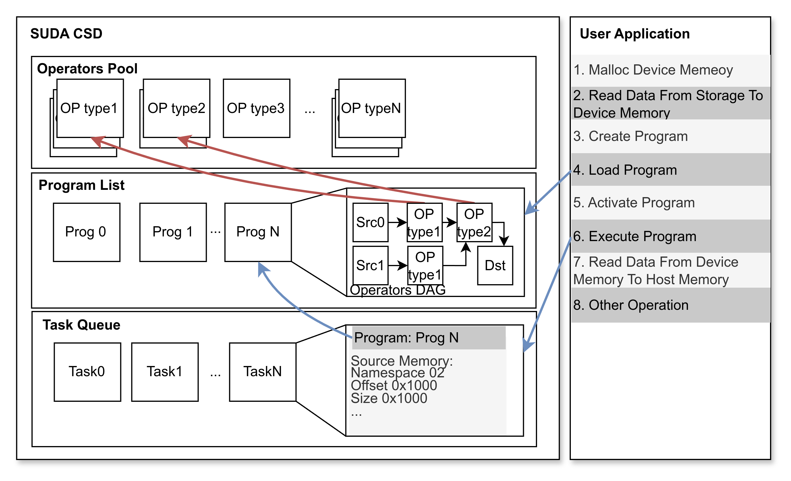
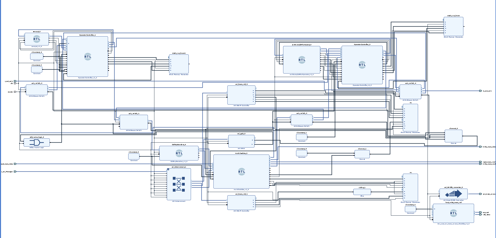
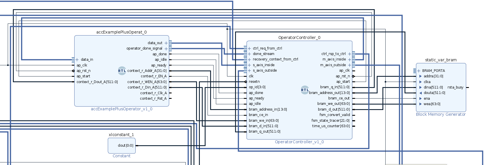
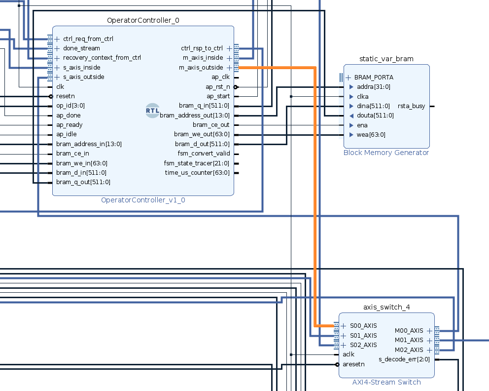
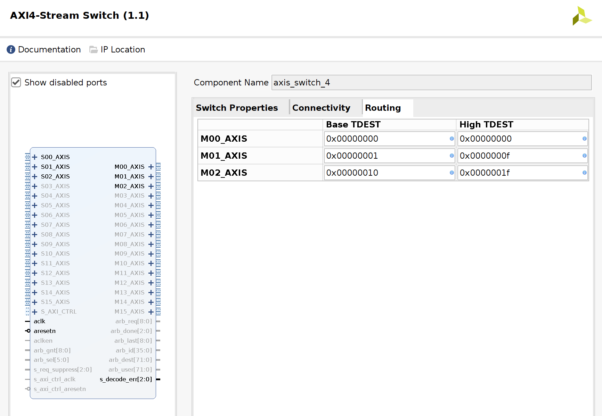
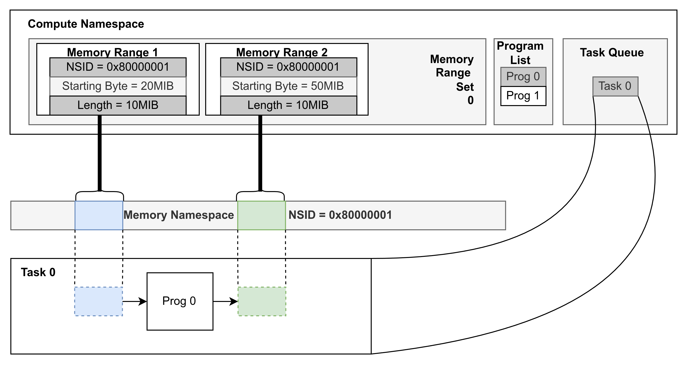

# 新增算子和程序

## 算子/计算程序/主机应用的关系

SUDA中定义，算子是执行简单计算逻辑的单元；计算程序是卸载到CSD上执行的程序，会调用若干算子；主机应用会调用CSD，发起计算任务，请求调用计算程序。具体如下图所示。


用户通过加载计算程序的API，将计算程序会保存在SUDA的程序列表中，计算程序会一次性调用若干算子。当前SUDA仅支持基于数据流的算子，计算程序为算子的有向无环图表示。用户应用会指定计算程序需要处理的数据大小和地址，并请求SUDA CSD调用计算程序。

## 新增算子

SUDA支持两类算子，一个是运行在SoC上的软件算子，另一个是运行在FPGA上的硬件算子，两类算子均支持使用HLS进行开发。
为了新增一个算子，首先需要在`suda/device/operators/hls`目录新增一个文件夹，假设当前需要新增的算子名称为filter:

```shell
cd device/operators/hls
mkdir -p filter
```

随后，编辑`device/operators/hls/Makefile`，Makefile支持软/硬算子两类编译目标，本示例将filter同时转换为硬算子和软算子：

```shell
---
# 定义目标名称
SWOP_TARGETS := blowfish grep
HWOP_TARGETS := blowfish
++++
# 定义目标名称
SWOP_TARGETS := blowfish grep filter
HWOP_TARGETS := blowfish filter
```

首先，新增硬算子生成需要的文件，在filter文件夹下新增如下的文件：

```
filter.cpp
filter.hpp
test.cpp
run_hls.tcl
```

`filter.cpp`和`filter.hpp`包含了对filter算子的HLS定义和实现，而`test.cpp`是对算子的测试激励，`run_hls.tcl`负责创建vitis_hls项目/仿真/RTL生成。

下列代码使用大语言模型生成，不保证可用性，仅作为演示。注意，算子都需要使用流式接口，仅允许使用一个512位宽的Bram访问接口，需要阻止每个算子的流式接口生成寄存器：
```c++
void filter(Acc_Data &data_in, Acc_Data &data_out, ap_uint<512> context[256]) {
    #pragma HLS INTERFACE mode=axis register_mode=off port=data_in //阻止生成寄存器
    #pragma HLS INTERFACE mode=axis register_mode=off port=data_out //阻止生成寄存器
    #pragma HLS INTERFACE mode=bram port=context //仅使用512位的Bram接口，随机访存
    ...
}
```
```c++
//[filter.cpp]
// 过滤器上下文结构
struct FilterContext {
    int threshold;           // 过滤阈值
    unsigned int processed_rows;    // 已处理的行数
    unsigned int processed_elements; // 已处理的元素数量
};
// 简化版 Filter 实现
void filter(Acc_Data &data_in, Acc_Data &data_out, ap_uint<512> context[256]) {
    #pragma HLS INTERFACE mode=axis register_mode=off port=data_in
    #pragma HLS INTERFACE mode=axis register_mode=off port=data_out
    #pragma HLS INTERFACE mode=bram port=context
    
    // 获取上下文
    FilterContext *filter_context = (FilterContext*)(((struct AccContext*)context)->static_data);
    
    // 读取输入数据包
    static Acc_Data_Pkt input_pkt;
    static Acc_Data_Pkt output_pkt;
    static int cnt = 0;
    static int pcnt = 0;
    
    // 过滤后的数据存储
    int* filtered_data = (int*)&(output_pkt.data);
    int filter_idx = 0;
    
    while (pcnt != 16777216) { // 与原代码保持一致的循环条件
        data_in.read(input_pkt);
        
        // 提取数据并处理
        int* data_values = (int*)(&(input_pkt.data));
        pcnt++;
        
        // 应用过滤器
        for (int i = 0; i < DATA_BUS_WIDTH/32; i++) {
            // 根据阈值过滤数据
            if (data_values[i] > filter_context->threshold) {
                filtered_data[filter_idx++] = data_values[i];
                
                // 当达到输出缓冲区容量时发送数据
                if (filter_idx == TDATA_WIDTH/32) {
                    output_pkt.last = false;  // 不是最后一个包
                    output_pkt.user = input_pkt.user;
                    data_out.write(output_pkt);
                    filter_idx = 0;  // 重置过滤计数器
                }
            }
        }
        
        // 更新计数器
        if (cnt == 256) {
            cnt = 0;
            filter_context->processed_rows++;
        } else {
            ++cnt;
        }
        
        filter_context->processed_elements += DATA_BUS_WIDTH/32;
    }
    
    // 发送最后一个包（如果有剩余数据）
    if (filter_idx > 0) {
        // 填充剩余的位置为0
        for (int i = filter_idx; i < TDATA_WIDTH/32; i++) {
            filtered_data[i] = 0;
        }
        output_pkt.last = 1;
        output_pkt.user = 0xf0;
        data_out.write(output_pkt);
    }
}
//[filter.hpp]
#pragma once
#include "hlsacc_types.hpp"
// 简化版 Grep 函数声明
void filter(Acc_Data &data_in, Acc_Data &data_out, ap_uint<512> context[256]);
//[test.cpp]
#include <iostream>
#include <vector>
#include <cstring>
#include <cstdlib>
#include <ctime>
#include "ap_int.h"
#include "hls_stream.h"

// 包含相关结构体定义
// ...

// 测试用的生成随机数据函数
void generate_random_data(std::vector<int>& data, int size, int min_val, int max_val) {
    data.resize(size);
    for (int i = 0; i < size; i++) {
        data[i] = min_val + rand() % (max_val - min_val + 1);
    }
}

// 打印数据函数
void print_data(const std::vector<int>& data, const char* label) {
    std::cout << label << ": ";
    for (size_t i = 0; i < std::min(data.size(), size_t(10)); i++) {
        std::cout << data[i] << " ";
    }
    if (data.size() > 10) {
        std::cout << "... (total: " << data.size() << " elements)";
    }
    std::cout << std::endl;
}

int main() {
    srand(time(NULL));
    
    // 创建输入和输出流
    hls::stream<Acc_Data_Pkt> input_stream;
    hls::stream<Acc_Data_Pkt> output_stream;
    
    // 创建上下文
    ap_uint<512> context[256];
    memset(context, 0, sizeof(context));
    
    // 设置过滤器上下文
    struct AccContext acc_context;
    struct FilterContext filter_context;
    filter_context.threshold = 500;  // 设置阈值为500
    filter_context.processed_rows = 0;
    filter_context.processed_elements = 0;
    
    acc_context.static_data = &filter_context;
    memcpy(context, &acc_context, sizeof(acc_context));
    
    // 生成测试数据
    const int num_packets = 100;
    const int values_per_packet = DATA_BUS_WIDTH / 32;  // 假设每个值是32位
    
    std::vector<int> test_data;
    generate_random_data(test_data, num_packets * values_per_packet, 0, 1000);
    
    // 创建输入数据包
    std::vector<Acc_Data_Pkt> input_packets(num_packets);
    for (int i = 0; i < num_packets; i++) {
        memcpy(&input_packets[i].data, &test_data[i * values_per_packet], values_per_packet * sizeof(int));
        input_packets[i].last = (i == num_packets - 1);
        input_packets[i].user = 0;
        
        // 将数据包推入输入流
        input_stream.write(input_packets[i]);
    }
    
    // 调用filter函数
    filter(input_stream, output_stream, context);
    
    // 收集并检查结果
    std::vector<int> filtered_data;
    while (!output_stream.empty()) {
        Acc_Data_Pkt output_pkt = output_stream.read();
        int* values = (int*)(&output_pkt.data);
        
        for (int i = 0; i < values_per_packet; i++) {
            if (values[i] > 0) {  // 非零值是有效数据
                filtered_data.push_back(values[i]);
            }
        }
    }
    
    // 打印结果
    print_data(test_data, "原始数据");
    print_data(filtered_data, "过滤后数据");
    
    // 验证过滤器是否正确工作
    int expected_filtered_count = 0;
    for (int val : test_data) {
        if (val > filter_context.threshold) {
            expected_filtered_count++;
        }
    }
    
    std::cout << "阈值: " << filter_context.threshold << std::endl;
    std::cout << "预期过滤后数据数量: " << expected_filtered_count << std::endl;
    std::cout << "实际过滤后数据数量: " << filtered_data.size() << std::endl;
    std::cout << "已处理行数: " << filter_context.processed_rows << std::endl;
    std::cout << "已处理元素数: " << filter_context.processed_elements << std::endl;
    
    return 0;
}
```
此外`run_hls.tcl`可以从示例项目中拷贝：
```shell
cp device/operators/hls/grep/run_hls.tcl device/operators/hls/filter/run_hls.tcl
```
修改其中的`set_top`命令，将顶层修改为filter:
```tcl
---
# 设置顶层函数
puts "Setting top function to: ${target_name}"
set_top SimpleGrep

+++
# 设置顶层函数
puts "Setting top function to: ${target_name}"
set_top filter

```

在`device/operators`目录下输入`make prj_gen`可以生成所有FPGA算子的vitis_hls项目，可以使用vitis_hls打开`device/operators/filter/solution1`进行CSIM/COSIM仿真，在运行完成后，使用`make hwop_gen`生成RTL代码压缩包`blowfish_ip.zip`解压并将其`verilog`文件夹拷贝到`device/platform/basic_shell/nf-csd/shell/virt_one_drive/fpga/sources/hlsaccframework/filter`，接下来编辑`device/platform/basic_shell/nf-csd/fpga/shell/virt_one_drive/scripts/prj_setup.tcl`

```tcl
# add custom_cpu source HDL files
add_files -norecurse -fileset sources_1 ${design_dir}/../fpga/sources/hdl/
# 添加源文件
add_files -fileset sources_1 [glob -nocomplain ${design_dir}/../fpga/sources/hlsaccframework/hlsacc_rspreceiver/*.v]
add_files -fileset sources_1 [glob -nocomplain ${design_dir}/../fpga/sources/hlsaccframework/hlsacc_scheduler/*.v]
add_files -fileset sources_1 [glob -nocomplain ${design_dir}/../fpga/sources/hlsaccframework/OperatorController/*.v]
add_files -fileset sources_1 [glob -nocomplain ${design_dir}/../fpga/sources/hlsaccframework/SimpleOperator/*.v]
add_files -fileset sources_1 [glob -nocomplain ${design_dir}/../fpga/sources/hlsaccframework/SoftResetMCDMA/*.v]
add_files -fileset sources_1 [glob -nocomplain ${design_dir}/../fpga/sources/hlsaccframework/blowfish_en/*.v]
# Add New Filter Path
add_files -fileset sources_1 [glob -nocomplain ${design_dir}/../fpga/sources/hlsaccframework/filter/*.v]
```
接下来`cd suda/device/platform/basic_shell/nf-csd/work_farm`，输入下列命令：
```shell
make PRJ=shell:virt_one_drive:accframework FPGA_BD=fidus FPGA_ACT=dcp_gen vivado_prj
```
该命令会执行刚刚修改的prj_setup.tcl，并且创建一个仅有FPGA算子池的硬件模块，且综合并保存为dcp文件。
当前还未将filter算子正式加入到算子池中，因此需要使用Vivado2020.2打开`suda/device/basic_shell/nf-csd/work_farm/fpga/vivado_prj/shell_virt_one_drive_accframework_fidus`，打开`block design`，将算子添加至算子池中。算子池的总体Block Design如下所示：


不同算子被总体的辅助调度器AccScheduler控制，每个算子都会有一个独立的Bram以及一个独立的控制器。
需要将filter模块添加，并且按照图中示例新增一个OperatorContoller、一个BRAM Generator、以及给OperatorController的op_id位赋上固定值，指示当前算子的`slot_id`，后续管理控制流（ctrl_req_from_ctrl、ctrl_rsp_to_ctrl、recovery_context_from_ctrl）会通过slot_id路由，包含数据源/目的的若干数据流（m_axis_outside[N],s_axis_outside[N]）会根据通道编号N和slot_id路由。


在创建完算子的四个模块后，需要将其和数据流互联连接。AccScheduler需要发送`ctrl_req_from_ctrl`的请求数据流控制算子、发送`recovery_context_from_ctrl`的恢复上下文数据流，并且接收来自算子的`ctrl_rsp_to_ctrl`响应数据流，算子需要接收来自上级算子/DMA的数据流（s_axis_outside），经过一个FIFO后发送给实际的计算逻辑filter的data_in接口，在计算完成后，从data_out接口写入到s_axis_inside接口，并通过m_axis_outside接口发送出去，路由到下一级算子或者是DMA。
以m_axis_outside接口为例，其连接到了一个数据流互联`axis_switch_4`，它使用{通道编号：slot_id}的方式路由，filter算子仅有一个数据流出接口，因此这个通道编号为0，如果新增接口，编号需要依次递增。打开axis_switch_4的设置，选择Routing，默认状态下有三个输出接口，M00会流入slot_id为0的算子，M01会流入DMA（本应为F0——FN，目前实现上为01——0F）,M02会流入slot_id为2的算子。实际调用算子时，AccScheduler会向OperatorController发送配置信息，OperatorController会根据配置信息动态配置算子数据流的路由。假设filter的slot_id被配置为2，应当新增S03_AXIS接口和M03_AXIS接口，M03_AXIS接口连接到属于filter的OperatorController的s_axis_outside接口，S03_AXIS接口连接到属于filter的OperatorController的m_axis_outside接口，且需要在Routing处，配置M03_AXIS路由的Base TDEST为0x20，High TDEST由于目前filter仅有一个流入接口，设置为0x20到0x2f均可。




配置完成后，在Vivado图形界面上方的工具栏选择`File->Export->Export Block Design`，保存位置选择为:`suda/device/platform/basic_shell/nf-csd/shell/virt_one_drive/fpga/scripts/accframework.tcl`

然后可以通过`bash build_bd.sh`重新生成FPGA比特流。

对于软算子流程，除了上述的文件，还需要下列几个文件：
```
dynamiclib_test.c
sw_wrapper.c
sw_wrapper.h
sw_wrapper.map
```

`sw_wrapper.c`、`sw_wrapper.h`以及`sw_wrapper.map`帮助基于C++的HLS实现封装为暴露有C函数的动态链接库供SoC上的软算子使用，`dynamiclib_test.c`负责测试在作为动态链接库的情况下，算子是否能正常工作。

```c++
//[sw_wrapper.c]
#include "sw_wrapper.h"
#include "blowfish.hpp"

#ifndef USING_XILINX_STREAM
// 静态全局变量
static Acc_Data g_data_in[SW_THREAD_NUM][TX_PORT_NUM];
static Acc_Data g_data_out[SW_THREAD_NUM][RX_PORT_NUM];
static ap_uint<512> g_context[SW_THREAD_NUM][OP_NUM][256];
//static hls::stream<ap_uint<TDEST_WIDTH>> g_operator_done_signal;

// 实现data_in_write函数 - 直接从用户缓冲区写入
extern "C" int  data_in_write(unsigned long long* buffer, unsigned int size, unsigned int port_id,int thread_id) {
    #ifndef __SYNTHESIS__
        if(buffer == NULL)
            return -1;
        g_data_in[thread_id][port_id].reset(buffer,size/64,size/64);
    #endif

    return 0;
}

// 实现data_out_read函数 - 直接写入用户缓冲区
extern "C" int data_out_read(unsigned long long* buffer, unsigned int size, unsigned int port_id,int thread_id) {
    #ifndef __SYNTHESIS__
        if(buffer == NULL)
            return -1;
        g_data_out[thread_id][port_id].reset(buffer,size/64,0);
    #endif
    return 0;
}

// 实现context写入函数
extern "C" void context_write(unsigned long long* data, int size,unsigned int op_id,int thread_id) {
    memcpy((char*)(&(g_context[thread_id][op_id][0])),data,size);
}


// 主运行函数 - 使用用户提供的缓冲区
extern "C" int run(int thread_id) {
    // 运行主处理函数
    //printf("run\n");
    filter(g_data_in[thread_id][0], g_data_out[thread_id][0]);
    
    return 0;
}

extern "C" int data_last(unsigned int port_id,int thread_id){
    bool last = g_data_out[thread_id][port_id].last();
    if(last){
        //printf("LAST\n");
    }
    return g_data_out[thread_id][port_id].last();
}


#endif
//[sw_wrapper.h]
#ifndef ACC_EXAMPLE_PLUS_WRAPPER_H
#define ACC_EXAMPLE_PLUS_WRAPPER_H

#ifdef __cplusplus
extern "C" {
#endif

#define TX_PORT_NUM 1
#define RX_PORT_NUM 1
#define OP_NUM 1
#define SW_THREAD_NUM 2
// 配置结构体
typedef struct {
    unsigned long long* input_buffer;   // 用户输入缓冲区（512位对齐）
    unsigned long long* output_buffer;  // 用户输出缓冲区（512位对齐）W
    unsigned int input_size;           // 输入大小（以512位为单位）
    unsigned int output_size;          // 输出大小（以512位为单位）
} acc_buffer_config_t;

// 对外暴露的函数接口
__attribute__((visibility("default"))) int  data_in_write(unsigned long long* buffer, unsigned int size, unsigned int port_id,int thread_id);
__attribute__((visibility("default"))) int  data_out_read(unsigned long long* buffer, unsigned int size, unsigned int port_id,int thread_id);
__attribute__((visibility("default"))) void context_write(unsigned long long* data, int size,unsigned int op_id,int thread_id);
__attribute__((visibility("default"))) int  run(int thread_id);
__attribute__((visibility("default"))) int  data_last(unsigned int port_id,int thread_id);
__attribute__((visibility("default"))) int  get_data_size(unsigned int port_id,int thread_id);

#ifdef __cplusplus
}
#endif

#endif // ACC_EXAMPLE_PLUS_WRAPPER_H
//[sw_wrapper.map]
 {
    global:
        data_in_write;
        data_out_read;
        context_write;
        data_last;
        run;
        get_data_size;
    local: *;
};
//[dynamictlib_test.c]
#include "dlfcn.h"
#include "sys/mman.h"
#include "sys/stat.h"
#include "fcntl.h"
#include "unistd.h"
#include "stdio.h"
#include "stdlib.h"
#include <sys/time.h>

typedef int  (*data_in_write_func_t)(unsigned long long* buffer, unsigned int size, unsigned int port_id,int thread_id);
typedef int  (*data_out_read_func_t)(unsigned long long* buffer, unsigned int size, unsigned int port_id,int thread_id);
typedef void (*context_write_func_t)(unsigned long long* data, int size,unsigned int op_id,int thread_id);
typedef int  (*run_func_t)(int thread_id);
typedef int  (*data_last_func_t)(unsigned int port_id,int thread_id);

int main(){
    struct timeval start,end;
    printf("running\n");
    void* handle = dlopen("./libfilter_x86.so",RTLD_NOW);
    for(int i=0;i<2;i++){
    if(handle == NULL){
        fprintf(stderr,"Failed to create handle\n");
        char* error = dlerror();
        if (error != NULL) {
            fprintf(stderr,"dlopen error: %s\n", error);
            
        }
        return 0;
    }

    data_in_write_func_t data_in_write =
        dlsym(handle, "data_in_write");
    data_out_read_func_t data_out_read =
        dlsym(handle, "data_out_read");
    context_write_func_t context_write = 
        dlsym(handle,"context_write");
    run_func_t run = dlsym(handle, "run");
    data_last_func_t last = dlsym(handle,"data_last");
    if (!data_in_write) {
        fprintf(stderr,"Failed to lookup func\n");
        return 0;
    }
    unsigned long long *tx_buffer = malloc(1024*1024);
    unsigned long long *rx_buffer = malloc(1024*1024);
    if(tx_buffer==NULL||rx_buffer==NULL){
        fprintf(stderr,"Failed to load data\n");
    }
    data_in_write(tx_buffer,1024*1024,0,0);
    data_out_read(rx_buffer,1024*1024+4096,0,0);
    context_write(tx_buffer,2048,0,0);
    int cur_size = 0;
    gettimeofday(&start,NULL);
    
    while(1){
        run(0);
        if(last(0,0)){
            printf("Finish\n");
            break;
        }   
    }
}
    return 0;

}
```
准备好上述文件后，在`device/operators/hls/`目录下使用`make sw_test`可以编译运行在x86的动态链接库以及测试链接库的程序`dynamiclib_test`，而使用`make swop_gen`可以生成运行在SoC（ARM Core）上的动态链接库，对于具体应该如何将软算子部署在SUDA CSD上，参考新增计算程序章节。

## 新增计算程序/主机应用

SUDA的主机应用使用基于内存搬运的编程模型编程，遵照NVMe CS的标准实现。在内存搬运的编程模型下，数据需要从存储资源中拷贝到设备内存，经过计算后，在拷贝到设备内存。
具体在NVMe CS标准下，CSD具有多个命名空间（Namespace），NVM Namespace负责存储、Memory Namespace管理设备内存、Compute Namespace管理计算，在Namespace之上的管理。不同Namespace之间的相互访问需要通过NVMe管理命令配置（但是SUDA默认允许任意相互访问）。


Compute Namespace内部有一个Program List记录了该Namespace可以执行的计算程序，当用户调用计算程序时，显而易见地需要告知计算程序需要处理哪些数据（允许访问的设备内存的地址和大小），而Memory Namespace定义了一片大的内存空间，一次计算只需要访问其中的一小片内存空间，输入的数据和处理的结果在大多数情况下也并非同样的一片空间，因此NVMe CS标准定义了Memory Range Set，这是在Compute Namespace内允许访问的设备内存范围，符合NVMe CS标准的计算程序只能访问Memory Range Set对应的内存空间。在SUDA中，Memory Range Set代表要处理的源数据和目的数据的空间。假设计算程序需要两个输入一个输出，那么Memory Range Set包含{源数据空间0，源数据空间1，目的数据空间0}。



下面本文将讲述如何正式新增一个计算程序并且调用，首先，主机应用代码都存放在`suda/host/applications/`目录下，在该目录下新建文件夹`vscode-filter-offload`，新增文件`vscode-filter-offload.cpp、Makefile`，Makefile内容如下：

```makefile
#
#  BSD LICENSE
#
#  Copyright (c) 2025
#  All rights reserved.
#
#  Redistribution and use in source and binary forms, with or without
#  modification, are permitted provided that the following conditions
#  are met:
#
#    * Redistributions of source code must retain the above copyright
#      notice, this list of conditions and the following disclaimer.
#    * Redistributions in binary form must reproduce the above copyright
#      notice, this list of conditions and the following disclaimer in
#      the documentation and/or other materials provided with the
#      distribution.
#    * Neither the name of the copyright holder nor the names of its
#      contributors may be used to endorse or promote products derived
#      from this software without specific prior written permission.
#
#  THIS SOFTWARE IS PROVIDED BY THE COPYRIGHT HOLDERS AND CONTRIBUTORS
#  "AS IS" AND ANY EXPRESS OR IMPLIED WARRANTIES, INCLUDING, BUT NOT
#  LIMITED TO, THE IMPLIED WARRANTIES OF MERCHANTABILITY AND FITNESS FOR
#  A PARTICULAR PURPOSE ARE DISCLAIMED. IN NO EVENT SHALL THE COPYRIGHT
#  OWNER OR CONTRIBUTORS BE LIABLE FOR ANY DIRECT, INDIRECT, INCIDENTAL,
#  SPECIAL, EXEMPLARY, OR CONSEQUENTIAL DAMAGES (INCLUDING, BUT NOT
#  LIMITED TO, PROCUREMENT OF SUBSTITUTE GOODS OR SERVICES; LOSS OF USE,
#  DATA, OR PROFITS; OR BUSINESS INTERRUPTION) HOWEVER CAUSED AND ON ANY
#  THEORY OF LIABILITY, WHETHER IN CONTRACT, STRICT LIABILITY, OR TORT
#  (INCLUDING NEGLIGENCE OR OTHERWISE) ARISING IN ANY WAY OUT OF THE USE
#  OF THIS SOFTWARE, EVEN IF ADVISED OF THE POSSIBILITY OF SUCH DAMAGE.
#

ROOT_DIR := $(abspath $(CURDIR)/../..)
include $(ROOT_DIR)/mk/common.mk

APP = vscode-filter-offload

# 应用程序源文件
CXX_SRCS := vscode-filter-offload.cpp

# 添加包含路径

CXXFLAGS += -I$(ROOT_DIR)/api/liburing/src/include
CXXFLAGS += -I$(ROOT_DIR)/api/libnvme/src

# 生成目标文件列表
OBJS = $(CXX_SRCS:.cpp=.o)

# 链接库
LIBS = $(ROOT_DIR)/api/libnvme/.build/src/libnvme.a
LIBS += -lssl -lcrypto -lstdc++ -lm -lpthread 
LIBS += $(ROOT_DIR)/api/liburing/src/liburing.a


.PHONY: all clean

all: $(APP)

$(APP): $(OBJS)
	$(CXX) $(CXXFLAGS) -o $@ $(OBJS) $(LDFLAGS) $(LIBS)

clean:
	rm -f $(APP) $(OBJS)
```
并且在`suda/host/applications/Makefile`修改内容，新增编译目录`vscode-filter-offload`：

```makefile
---
# 所有的应用程序子目录
APP_DIRS = vscode-blowfish-offload vscode-grep-sw vscode-slmcopy-test

+++

# 所有的应用程序子目录
APP_DIRS = vscode-blowfish-offload vscode-grep-sw vscode-slmcopy-test vscode-filter-test

```

接下来，编辑`vscode-filter-offload`，包含必要的头文件，并且打开SUDA CSD：
```c++
// 包含必要的头文件 / Include necessary header files
#include <stdio.h>
#include <string.h>
#include <stdlib.h>
#include <inttypes.h>
#include <libnvme.h>
#include <thread>
#include <time.h>
#include <vector>
#include <atomic>
#include <iostream>
#include <sys/time.h>
#include <unistd.h>
#include "liburing.h"

// 定义常量 / Define constants
#define LBA_SIZE 4096                // 逻辑块地址大小 / Logical Block 
#ifdef DEBUG
#define DEBUG_LOG(...) printf(__VA_ARGS__) 
#else
#define DEBUG_LOG(...)
#endif

int main(int argc, char **argv){
    struct nvme_io_args args;
    int io_fd = nvme_open("nvmq0n1");
    int admin_fd = nvme_open("nvmq0");
}
```

io_fd指向的设备用于传递IO命令，admin_fd用于传递管理命令，正常情况下，nvmq0n1为第0个设备的第1个命名空间，为NVM空间，但是为了减少开发复杂度，第1个命名空间目前允许接收其他命名空间的指令，仅需在NVMe命令上携带正确的nsid即可。

接下来，在main函数继续添加内容，创建一个内存空间，专门用于此次计算：

```c++
int io_fd = nvme_open("nvmq0n1");
int admin_fd = nvme_open("nvmq0");
int mem_id;

ret = nvme_create_slm_ns(admin_fd, &input_mem_id, LBA_SIZE*256);
```

接下来，创建一个计算程序，如果是仅需要在FPGA上执行的计算程序，仅需要描述算子的数据流连接关系，假设算子的`type_id`设定为2：

```c++
/**
 * 创建一个计算程序
 * Create a computation program
 */
struct hlsacccompute_program p, *program;
program = &p;
program->input_channum = 1;                   // 输入通道数 / Input channel count
program->output_channum = 1;                  // 输出通道数 / Output channel count
program->program_id = 1;                      // 程序ID / Program ID
program->apply_operators_id_map[0] = 2;       // 申请一个1号算子，对应功能是加密 / Request operator 1 for encryption
program->applyops[0].header.cid = 0;          // 通道ID / Channel ID
program->applyops[0].header.opc = APPLY_OPS;  // 操作码 / Operation code
program->applyops[0].header.ops_num = 1;      // 操作数量 / Operation count
program->applyops[2].apply_ops_payload2.connections_num = 1; // 连接数量 / Connection count
program->applyops[2].apply_ops_payload2.connections[0].from = 0 << 4 | 0; // 来源 / Source
// ffff表示是通道，请求分配一条出口通道 / ffff indicates channel, requesting an output channel
program->applyops[2].apply_ops_payload2.connections[0].to = 0xf0; // 目标 / Destination
program->pauseops[0].header.cid = 0;                // 通道ID / Channel ID
program->pauseops[0].header.opc = SUSPEND_OPS;      // 暂停操作 / Suspend operation
program->pauseops[0].header.ops_num = 1;            // 操作数量 / Operation count
program->pauseops[1].generic_ops_payload.op_lists[0] = 0;
program->freeops[0].header.cid = 0;                 // 通道ID / Channel ID
program->freeops[0].header.opc = FORCE_FREE_OPS;    // 强制释放操作 / Force free operation
program->freeops[0].header.ops_num = 1;             // 操作数量 / Operation count
program->freeops[1].generic_ops_payload.op_lists[0] = 0;
program->input_channel_destination[0] = 0;
program->apply_ops_size = 3;                        // 应用操作大小 / Apply operation size
program->apply_operators_num = 1;                   // 应用操作数量 / Apply operation count
program->esti_executed_time = 35;                   // 估计执行时间 / Estimated execution time
program->max_responded_time = program->esti_executed_time * 3; // 最大响应时间 / Maximum response time
int psize = sizeof(struct hlsacccompute_program);
// 加载程序 / Load program
ret = nvme_load_hlsacc_program(admin_fd, psize, 1, 2, program);
// 激活程序 / Activate program
ret = nvme_activate_program(admin_fd, 1, 2);
```

上述代码中，`apply_operator_id_map`是用户需要申请的算子列表，用户申请`type_id`为2的算子，因此`apply_operator_id_map[0]`为1。此外，如果直接将program描述为DAG图，程序在调用算子/计算完成时都需要重新解析DAG图转换为可供SUDA CSD解析的命令，为了减少这部分开销，program直接描述了调用算子/计算完成/暂停计算等操作针对算子连接关系需要进行的操作。在此program中，applyops描述调用程序时申请算子的操作，opc固定为`APPLY_OPS`，需要申请一个算子`ops_num=1`，`connections`描述了DAG图的边，`from`和`to`都按照`{slot_id在apply_operators_id_map的索引,channel_id}`的方式描述，这个算子的链接关系是数据流0接口流入DMA（filter算子type_id为2，在apply_operators_id_map索引为0，因此from为0，DMA用f标记，因此为0xf0），`input_channel_destination[0]`描述了DMA需要将第0个数据源流入。暂停程序和释放程序的操作类似，以`freeops`为例，opc固定为`FORCE_FREE_OPS`，`ops_num`指定该操作只涉及一个算子，op_lists记录了需要依次暂停的算子索引，0对应的在`apply_operator_id_map`对应的是type_id为3的filter算子。


当前progam默认类型为FPGA程序，也就是只能在FPGA上执行，如果需要在SoC上执行，需要准备libfilter.so动态链接库。当前SoC计算程序不支持多个算子共同工作，仅支持一次使用一个算子，因此加载SoC计算程序的过程也就是加载一个SoC算子的过程。下面是如果需要让程序在SoC上执行需要编写的代码，由于program的software_data指向了动态链接库，因此在load_program时，它也会直接被传递到SUDA CSD上。

```c++
// 创建并初始化计算程序结构 / Create and initialize computation program structure
    struct hlsacccompute_program p, *program;
    memset(&p, 0, sizeof(struct hlsacccompute_program));
    program = &p;
    program->input_channum = 1;                    // 输入通道数 / Number of input channels
    program->output_channum = 1;                   // 输出通道数 / Number of output channels
    program->program_id = 1;                       // 程序ID / Program ID
    program->apply_operators_id_map[0] = 0;        // 算子ID映射 / Operator ID mapping
    program->applyops[0].header.cid = 0;           // 通道ID / Channel ID
    program->applyops[0].header.opc = APPLY_OPS;   // 操作码 / Operation code
    program->applyops[0].header.ops_num = 1;       // 操作数量 / Number of operations
    program->applyops[2].apply_ops_payload2.connections_num = 1; // 连接数量 / Number of connections
    program->applyops[2].apply_ops_payload2.connections[0].from = 0 << 4 | 0; // 连接来源 / Connection source
    
    // ffff表示是通道，请求分配一条出口通道 / ffff indicates a channel, requesting an output channel
    program->applyops[2].apply_ops_payload2.connections[0].to = 0xf0; // 连接目标 / Connection destination
    
    program->pauseops[0].header.cid = 0;           // 暂停操作通道ID / Pause operation channel ID
    program->pauseops[0].header.opc = SUSPEND_OPS; // 暂停操作码 / Pause operation code
    program->pauseops[0].header.ops_num = 1;       // 暂停操作数量 / Number of pause operations
    program->pauseops[1].generic_ops_payload.op_lists[0] = 0;
    
    program->freeops[0].header.cid = 0;            // 释放操作通道ID / Free operation channel ID
    program->freeops[0].header.opc = FORCE_FREE_OPS; // 强制释放操作码 / Force free operation code
    program->freeops[0].header.ops_num = 1;        // 释放操作数量 / Number of free operations
    program->freeops[1].generic_ops_payload.op_lists[0] = 0;
    
    program->apply_ops_size = 3;                   // 应用操作大小 / Apply operation size
    program->apply_operators_num = 1;              // 应用算子数量 / Number of apply operators
    program->esti_executed_time = 35;              // 估计执行时间 / Estimated execution time
    program->max_responded_time = program->esti_executed_time * 3; // 最大响应时间 / Maximum response time
 
    // 打开程序库文件 / Open program library file
    FILE* p_fp;
    p_fp = fopen("../../examples/data/libgrep.so.1.0.0", "r");
    if(p_fp == NULL){
        fprintf(stderr, "Failed to open lib!\n");
        exit(1);
    }
    
    // 获取文件状态 / Get file status
    struct stat p_stat;
    fstat(fileno(p_fp), &p_stat);
    fseek(p_fp, 0, SEEK_SET);
    
    // 分配软件数据缓冲区 / Allocate software data buffer
    char* software_data;
    posix_memalign((void **)&software_data, LBA_SIZE, LBA_SIZE+p_stat.st_size);
    if(software_data == NULL){
        fprintf(stderr, "Failed to copy programdata\n");
        exit(1);
    }
    
    // 复制程序结构到软件数据 / Copy program structure to software data
    memcpy(software_data, program, sizeof(struct hlsacccompute_program));
    
    // 设置软件数据指针为空 / Set software data pointer to NULL
    struct hlsacccompute_program* pp = (struct hlsacccompute_program*)software_data;
    pp->software_data = NULL;
    
    // 读取程序库文件到软件数据 / Read program library file to software data
    int read_psize = read(fileno(p_fp), ((void*)software_data)+LBA_SIZE, p_stat.st_size);
    if(read_psize != p_stat.st_size){
        fprintf(stderr, "Failed to read program size\n");
        exit(1);
    }
  
    // 加载HLSACC程序 / Load HLSACC program
    ret = nvme_load_hlsacc_program(fd, read_psize+LBA_SIZE, 1, 2, software_data);
    if(ret != 0){
        printf("ERR Failed to load hlsacc program!\n");
        return -1;
    }
    
    // 激活程序 / Activate program
    ret = nvme_activate_program(fd, 1, 2);
  
```

program会被加载到Compute Namepsace的program list的某个位置，这个位置需要由用户显式指定，该示例指定放在1号位置，目前的SUDA实现默认支持存放至多64个程序。

在创建完程序后，需要为该程序准备memory range set作为调用计算程序的数据源和数据目的，注意数据目的的大小永远要比计算后能输出的最大大小**要多一个页**，假设filter算子处理后，数据大小在0～LBA_SIZE\*16，那么需要准备LBA_SIZE*17的空间。


```c++
/**
     * 创建一个内存集，0元素表示输入，1元素表示输出
     * Create a memory range set, element 0 for input, element 1 for output
     */
    union memory_range_set_decriptor mdes[2];
    mdes[0].payload.mnsid = mem_id;         // 输入内存ID / Input memory ID
    mdes[0].payload.length = LBA_SIZE*16;      // 长度 / Length
    mdes[0].payload.starting_byte = 0;            // 起始字节 / Starting byte
    mdes[0].payload.flag = memory_range_descriptor::mdes_flag::MEM_RANGE_DEVICE_MEM; // 设备内存标志 / Device memory flag
    mdes[1].payload.mnsid = mem_id;        // 输出内存ID / Output memory ID
    mdes[1].payload.length = LBA_SIZE*17; // 长度 / Length
    mdes[1].payload.starting_byte = LBA_SIZE*16;            // 起始字节 / Starting byte
    mdes[1].payload.flag = memory_range_descriptor::mdes_flag::MEM_RANGE_DEVICE_MEM; // 设备内存标志 / Device memory flag
    unsigned int rsid = 0;
    
    // 创建内存范围集 / Create memory range set
    ret = nvme_create_memory_range_set(admin_fd, 2, &rsid, 2, mdes);
```

执行完成后，会获得rsid，用户可以根据program的索引（1）以及rsid执行程序，但是在执行程序之前，还需要将数据从存储拷贝到设备内存，下列代码表示需要从存储资源的0位置，读取LBA_SIZE*16（读取块至少为1块，因此nlb0即表示1个块，15表示读取16个块）

```c++
  // 设置源范围 / Set source range
union nvme_source_range *sr = (union nvme_source_range*)malloc(4096);

sr[0].scc.slba = 0;
sr[0].scc.nlb = 15;
sr[0].scc.snsid = 1;


ret = nvme_slm_copy(io_fd,sr,sizeof(union nvme_source_range),0,0x3,1,mem_id);
```

接下来，可以执行程序，program_id设置为1，程序如果需要让算子初始上下文作为参数，需要给context_data指向一片内存空间，每个算子都需要占据LBA_SIZE大小的空间作为上下文，`res`会记录处理完成之后的数据大小。

```c++
struct AccContext* context_data = nullptr;
unsigned int res = 0;
ret = nvme_execute_hlsacc_program(io_fd,2,rsid,1,context_data,0,0,0,&res);

```

在数据计算完成后，可以将数据从设备内存搬运回主机：

```c++
ret = nvme_slm_read(io_fd, mem_id, LBA_SIZE*16, LBA_SIZE*16, output_buf);
```

## 异步执行命令

上述过程为使用同步方式执行，每个步骤都需要执行完成才能继续下一步，SUDA也支持异步执行IO命令，本节将介绍如何将执行计算程序的函数替换为异步。

首先，需要打开专用于异步执行IO命令的设备`ng0n1`，并且初始化io_uring。

```c++
int uring_fd = open("/dev/ng0n1", O_RDWR);
struct io_uring ring;
ret = io_uring_queue_init(8, &ring, 0);
```

新增一个异步函数，该函数在执行计算的同时读取下一次需要使用的数据：
```c++
// 异步执行程序 / Execute program asynchronously
int program_exec_async(int fd, unsigned long long read_from_lba, unsigned long long write_to_saddr, int rsid, int pind, unsigned int mem_nsid, void* ptr)
{
    struct io_uring *ring = (struct io_uring*)ptr;
   
    struct io_uring_cqe *cqe;
    struct io_uring_sqe *sqe;
    int i, ret;
 
    // 准备两个命令 / Prepare two commands
    struct nvme_uring_cmd *cmd0 = (struct nvme_uring_cmd *)vecs[2].iov_base;
    struct nvme_uring_cmd *cmd1 = (struct nvme_uring_cmd *)vecs[3].iov_base;
    unsigned long long length = sizeof(union nvme_source_range)*8;
    
    // 设置第一个命令 - 写入 / Configure first command - write
    cmd0->opcode = 0x1;              // 写入操作码 / Write operation code
    cmd0->addr = (unsigned long long)(vecs[4].iov_base); // 数据地址 / Data address
    cmd0->data_len = length;         // 数据长度 / Data length
    cmd0->nsid = mem_nsid;           // 内存命名空间ID / Memory namespace ID
    cmd0->cdw2 = length;             // 长度低32位 / Low 32 bits of length
    cmd0->cdw3 = length >> 32;       // 长度高32位 / High 32 bits of length
    cmd0->cdw10 = write_to_saddr;    // 写入地址低32位 / Low 32 bits of write address
    cmd0->cdw11 = write_to_saddr >> 32; // 写入地址高32位 / High 32 bits of write address
    cmd0->flags = 0;                 // 标志位 / Flags
    cmd0->cdw12 = (0x3<<8)|7;        // 控制字 / Control word
    cmd0->cdw13 = 0;
    cmd0->cdw14 = 0;
    cmd0->cdw15 = 0;
    cmd0->flags = 0;
    
    // 设置第二个命令 - 程序执行 / Configure second command - program execution
    cmd1->opcode = 0x1;              // 写入操作码 / Write operation code
    cmd1->data_len = 0;              // 无数据 / No data
    cmd1->addr = NULL;               // 无地址 / No address
    cmd1->nsid = 2;                  // 命名空间ID / Namespace ID
    cmd1->cdw2 = rsid << 16 | pind;  // 内存范围集ID和程序索引 / Memory range set ID and program index
    cmd1->cdw3 = 0;
    cmd1->cdw10 = 0;
    cmd1->cdw11 = 0;
    cmd1->flags = 0;                 // 标志位 / Flags
    cmd1->cdw12 = 0;
    cmd1->cdw13 = 0;
    cmd1->cdw14 = 0;
    cmd1->cdw15 = 0;
    cmd1->flags = 0;

    //nvme_show_command((struct nvme_passthru_cmd*)cmd1);
    //nvme_show_command((struct nvme_passthru_cmd*)cmd0);
   
    // 获取提交队列入口并准备写入命令 / Get submission queue entry and prepare write command
    sqe = io_uring_get_sqe(ring);
    if (!sqe)
    {
        fprintf(stderr, "get sqe failed\n");
        goto err;
    }
    io_uring_prep_writev(sqe, fd, &(vecs[2]), 1, 0);
    
    sqe = io_uring_get_sqe(ring);
    if (!sqe)
    {
        fprintf(stderr, "get sqe failed\n");
        goto err;
    }
    
    io_uring_prep_writev(sqe, fd, &(vecs[3]), 1, 0);
    //io_uring_prep_read_fixed(sqe, fd, vecs[0].iov_base,
                              //vecs[0].iov_len, 0, 0);
    
    //io_uring_prep_read_fixed(sqe, fd, vecs[1].iov_base,
                            //vecs[1].iov_len, 0, 1);

    // 提交IO请求 / Submit IO requests
    ret = io_uring_submit(ring);

    if (ret < 0)
    {
        fprintf(stderr, "sqe submit failed: %d\n", ret);
        goto err;
    }
    else if (ret != 2)
    {
        fprintf(stderr, "Submitted Failed ret%d\n", ret);
        goto err;
    }

    // 等待完成队列事件 / Wait for completion queue events
    for (i = 0; i < 2; i++)
    {
        ret = io_uring_wait_cqe(ring, &cqe);
        if (ret < 0)
        {
            fprintf(stderr, "wait completion %d\n", ret);
            goto err;
        }
        if (cqe->res < 0)
        {
            fprintf(stderr, "I/O write error on %lu: %s\n",
                    (unsigned long)cqe->user_data,
                    strerror(-cqe->res));
            goto err;
        }
        io_uring_cqe_seen(ring, cqe);
    }
    
    // 打印命令执行结果 / Print command execution results
    printf("CMD 1 result%d\n", cmd0->rsvd2);
    printf("CMD 2 result%d\n", cmd1->rsvd2);
    //io_uring_unregister_buffers(ring);
    //free(vecs[0].iov_base);
    return 0;
err:
    return 1;
}
```

在main函数将execute_hlsacc_program替换：
```c++
program_exec_async(uring_fd, read_from+i*(input_buf_size/LBA_SIZE), 0, rsid, 1, input_mem_id, &ring);
```

### 运行程序


在配置完成环境后，即可以使用SUDA了。首先从SoC-FPGA CSD上启动软件栈：
```shell
cd software_stack/nf_spdk
bash setup.sh
cd mcdma 
bash run_nvmq.sh 
```
在等待SoC-FPGA CSD软件栈初始化完成后（一般等待5s），然后在主机端启动虚拟机：
```shell
sudo bash run_nvmq.sh -f
ssh -p8999 developer@localhost
#在虚拟机中
cd /mnt/suda/host/drivers/nvmq
sudo su
bash init_nvmq.sh
cat nvmq0_opts > /dev/nvmq-fabrics 
```
然后进入`/mnt/suda/host/applications/`目录，执行`make`编译程序，在编译结束后:

```shell
cd /mnt/suda/host/applications/vscode-filter-offload
./vscode-blowfish-offload
```